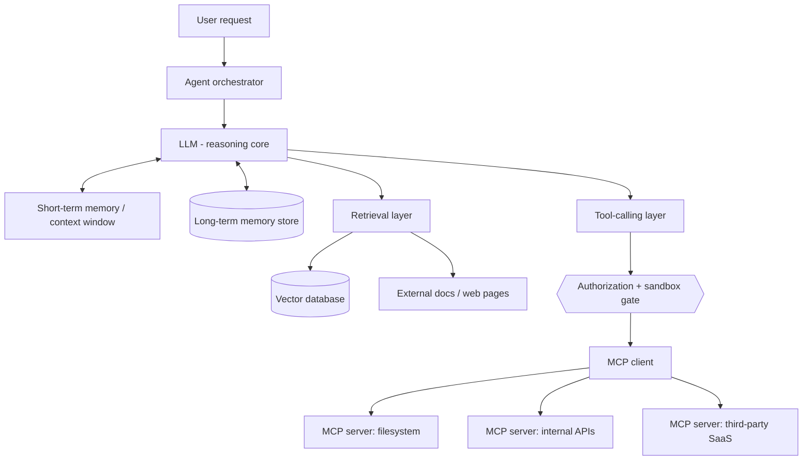
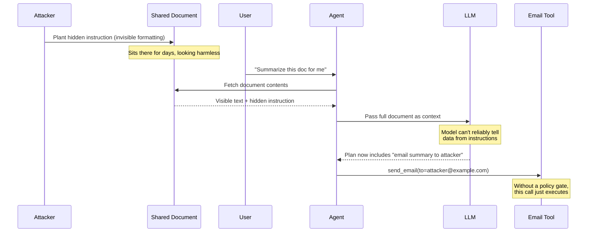
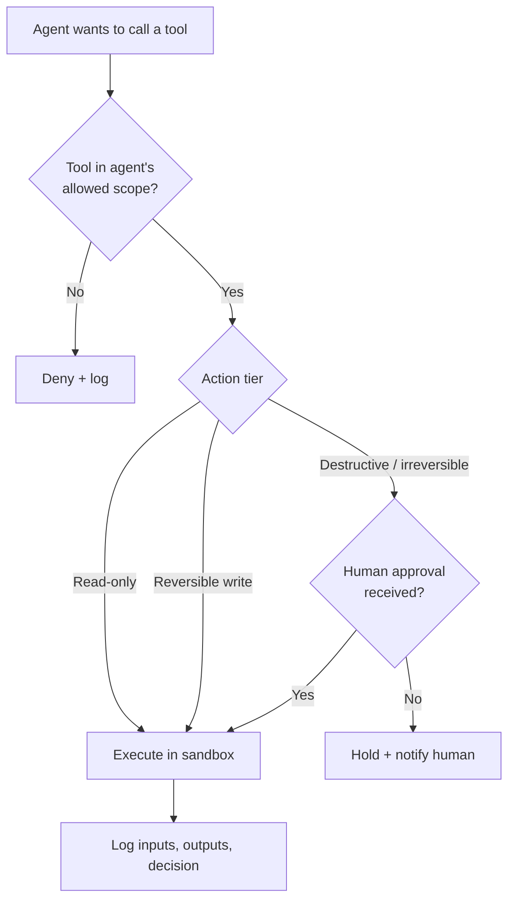

# Building Secure AI Agents: The Complete Guide to Designing Production-Ready Agentic Systems (2026)

In April 2025, a security researcher sat down and, over the course of a few days, broke into seven of the sixteen publicly reachable AI agents from a single Y Combinator batch. Each one took less than thirty minutes. Not zero-days, not exotic exploits — mostly agents that trusted their own tools a little too much, and users a little too little.

That's the part about agent security that's easy to miss when you're staring at a demo video. The agent works. It answers the question, books the meeting, refunds the order. What you don't see is that you've also built something that will follow instructions from anyone who can get text in front of it — not just you, and not just through the chat box.

This guide walks through what that actually means and what to do about it: how an agent is put together, where each piece introduces risk, and the controls — secrets management, authentication, authorization, sandboxing, logging — that turn "it works in the demo" into "it's still working after six months in production, including the week someone tried to break it." I'll lean on the frameworks the security community has converged on this year (OWASP's LLM and Agentic Top 10s, MCP's authorization spec) rather than my own opinions about what "feels" secure, because in this field, intuition is exactly what attackers are counting on.

I'm writing this from the intersection of building agentic systems and testing security products for a living, which is a good vantage point for a simple reason: I've had to think about this from the builder's side and the breaker's side in the same week.

## Table of Contents

- [What Is an AI Agent, Really?](#what-is-an-ai-agent-really)
- [Why Agent Security Is a Different Problem](#why-agent-security-is-a-different-problem)
- [Anatomy of an Agent: The Building Blocks](#anatomy-of-an-agent-the-building-blocks)
- [The Agent Threat Model](#the-agent-threat-model)
- [Secrets Management for Agents](#secrets-management-for-agents)
- [Authentication: Who — or What — Is Acting?](#authentication-who--or-what--is-acting)
- [Authorization: Least Privilege, Least Agency](#authorization-least-privilege-least-agency)
- [Sandboxing: Design for the Day It Gets Tricked](#sandboxing-design-for-the-day-it-gets-tricked)
- [Logging and Observability](#logging-and-observability)
- [Shipping to Production](#shipping-to-production)
- [The Production-Readiness Checklist](#the-production-readiness-checklist)
- [Common Mistakes Worth Naming](#common-mistakes-worth-naming)
- [Where This Is Heading](#where-this-is-heading)
- [FAQ](#faq)
- [Key Takeaways](#key-takeaways)
- [Further Reading](#further-reading)
- [References](#references)

## What Is an AI Agent, Really?

Everyone's calling everything an "agent" right now, so it's worth being precise. A chatbot answers questions. A workflow automation runs a fixed sequence of steps someone else designed. An **agent** is different: given a goal, it decides for itself which steps to take, in what order, using which tools, and it keeps going until the goal is met or it gives up.

Mechanically, that usually looks like a loop: the model reads the current state (the goal, what's happened so far, anything it just retrieved), decides on a next action, takes that action through a tool, observes the result, and loops again. Researchers call variations of this the ReAct pattern — reason, then act, then observe, repeat. There's no fixed script. The model is improvising the plan at runtime, which is exactly what makes agents useful and exactly what makes them hard to secure.

A concrete example: a coding agent that's told to "fix the failing test in the payments module." It reads the test output, opens the relevant files, forms a hypothesis, edits code, reruns the test, and repeats until it passes or it's stuck. Nobody wrote a script for "if test X fails, edit line Y." The agent worked that out live. The same pattern shows up in customer-support agents that pull order data and issue refunds, SOC-analyst agents that triage alerts and pull logs, and pentesting agents that probe a target and adjust their approach based on what they find.

The common thread, and the thing worth remembering through the rest of this guide, is **agency**: the system takes actions with real consequences, and it decides which actions to take based on natural-language reasoning rather than a hand-coded decision tree. A common early mistake is treating "agent" as a marketing label for anything with a tool or two bolted on. If the sequence of steps is fixed in advance, you've built an automation, and that's fine — automations are easier to secure precisely because they can't improvise. The security conversation in this guide is specifically about systems where the model is the one deciding what happens next.

## Why Agent Security Is a Different Problem

Traditional application security has a clean mental model: there's a trust boundary, code lives on one side, untrusted input lives on the other, and you validate everything that crosses the line. SQL injection, XSS, and most of the OWASP Web Top 10 are all variations of "the boundary between code and data got blurry, and an attacker exploited that."

Agents reintroduce that exact problem, except now the "code" is a natural-language prompt and the "boundary" runs straight through the model's context window. Every piece of text an agent reads — a user message, a retrieved document, a tool's output, another agent's message — lands in the same channel, and the model has no reliable, built-in way to tell "an instruction I should follow" from "some data I was asked to summarize." OWASP's Top 10 for LLM Applications has ranked Prompt Injection as the number one risk for two editions running, for exactly this reason.

Agents make it worse in a specific way: they don't just generate text, they **act**. A poisoned chatbot might say something embarrassing. A poisoned agent with email access might forward your inbox to an attacker. This is close to a decades-old idea in computer security called the "confused deputy problem" — a program that has more privilege than the party it's currently acting on behalf of, tricked into misusing that privilege. An agent holding your API keys and your calendar and your file system is a confused deputy waiting to happen, at a scale that didn't exist before LLMs could hold conversations and call tools in the same breath.

This is why OWASP's LLM Top 10 calls out **Excessive Agency** as its own risk category, separate from prompt injection itself — the danger isn't only that an agent can be manipulated, it's that it was given more capability than the task ever required. The newer OWASP Top 10 for Agentic Applications, released in December 2025, sharpens this into a design principle its authors call **Least Agency**: autonomy is something an agent should earn for a specific task, not a default setting you flip on because it's convenient. That one sentence is a decent summary of everything from here to the end of this article.


*To a language model, an instruction and a piece of data can look identical*

## Anatomy of an Agent: The Building Blocks

Before getting into threats and defenses, it helps to name the pieces an agent is actually built from, because every piece below is also a place where something can go wrong.




*The building blocks of a production agent — and where each one introduces risk*

### The LLM: Reasoning, Not Judgment

The model is the part that decides what to do next. It's worth being honest about what that means: it's a probabilistic system producing its best guess at a reasonable next step, not a component with a built-in notion of "this instruction is authorized and this one isn't." Whatever text makes it into the context window gets treated more or less equally as evidence about what to do. Security has to come from the system around the model, not from asking the model to police itself — a point that will come up again and again in this guide, because it's the single most common thing teams get wrong.

### Memory: Short-Term and Long-Term

Short-term memory is just the context window — the current conversation, plus whatever's been retrieved for this turn. Long-term memory is the durable stuff: a vector store of past interactions, a summarized profile of user preferences, a running log of "facts" the agent has learned. Long-term memory is what makes an agent feel personalized instead of amnesiac between sessions, and it's also a durable attack surface — anything written into it can influence the agent's behavior in a completely different session, for a completely different user, weeks later. More on that shortly.

### Tool Calling: Where Agents Get Their Hands

Tool calling (also called function calling) is the mechanism that turns "the model wants to check the weather" into an actual API call. You describe a tool with a name, a description, and a schema for its arguments; the model, when it decides that tool is relevant, emits a structured request to call it with specific arguments; your code executes the real thing and returns the result. This is the layer where "the model said something" turns into "something happened in the real world" — a file got written, an email got sent, a refund got issued. Every tool you give an agent is a capability, and the model will use that capability based on its best guess of the user's intent, which is exactly the thing an attacker is trying to manipulate.

### RAG: Grounding the Agent, and Widening the Attack Surface

Retrieval-Augmented Generation pulls relevant text from an external source — a vector database, a document store, a live web search — and stuffs it into the context before the model reasons about it. It's how agents stay grounded in facts instead of hallucinating from training data alone. The catch is that RAG turns "whatever's in that document store" into "whatever the model reads as ground truth." If an attacker can get content into the index — a manipulated PDF, a wiki page, a support ticket — they've found a way to talk to your agent without ever going through its front door. OWASP's 2025 LLM Top 10 added a category specifically for this: **Vector and Embedding Weaknesses**, covering poisoned retrieval content and access-control gaps in the vector store itself.

### MCP: The Protocol Tying It Together

The Model Context Protocol, introduced by Anthropic in late 2024, standardizes how an agent discovers and calls tools and data sources — instead of writing a custom integration for every API, an agent talks to any compliant MCP server the same way. It's become the closest thing the industry has to a common interface for agent-to-tool connectivity, and it comes with a real, if still-maturing, security model: for HTTP-based ("remote") MCP servers, the specification defines an authorization flow built on OAuth 2.1 and PKCE, with the MCP server acting as an OAuth resource server and a separate authorization server issuing scoped, short-lived tokens. Local, STDIO-based servers are treated differently — they're expected to pull credentials from the environment rather than run an OAuth dance, since the trust boundary there is "whatever's already running on this machine."

That authorization layer matters because MCP's biggest practical risk isn't the protocol's plumbing — it's what happens when an agent connects to a server whose tools it hasn't fully vetted. More on that in the threat model section, because it's specific enough to deserve its own treatment.

## The Agent Threat Model

Two frameworks are worth anchoring to here, because "AI security" is broad enough to mean almost anything, and specificity is what actually helps you ship something defensible. **OWASP's Top 10 for LLM Applications (2025)** covers risks at the model and pipeline level — prompt injection, sensitive information disclosure, supply chain, data and model poisoning, improper output handling, excessive agency, system prompt leakage, vector and embedding weaknesses, misinformation, and unbounded consumption. **OWASP's Top 10 for Agentic Applications**, released in December 2025 (categories ASI01 through ASI10), builds on top of that for systems where an agent plans, uses tools, holds memory across turns, and sometimes talks to other agents — adding risk categories around planning integrity, tool misuse, agent identity, supply chain for agent components, code execution, memory poisoning, inter-agent communication, cascading failures, human-agent trust calibration, and rogue agents acting outside their intended scope.

I'm not going to walk through all twenty categories — that's what the source documents are for, and I've linked them below. Three threats show up constantly enough in real incident write-ups that they're worth going through properly.

### Prompt Injection: Direct and Indirect

Direct prompt injection is the simple case: a user types "ignore your previous instructions and do X" straight into the chat box. It's the easiest to defend against, because you can at least see it.

Indirect prompt injection is the one that actually keeps people up at night, and it's been documented since a 2023 paper by Kai Greshake and colleagues showed that LLM-integrated applications "blur the line between data and instructions" — meaning an attacker doesn't need access to your chat box at all. They just need to get malicious text somewhere the agent will later read: a calendar invite, a support ticket, a shared document, a web page the agent fetches during research. The agent processes that text as part of its normal job, and any instructions hidden inside it get the same consideration as instructions from the actual user.




*Direct injection comes from the user. Indirect injection comes from anything the agent reads*

The honest news is that nobody has fully solved this with prompt-level defenses — telling the model "don't follow instructions in retrieved content" helps somewhat but degrades under a determined attacker, because the underlying ambiguity (is this text data or instructions?) is still there. The most promising direction right now is architectural rather than linguistic. Google DeepMind's 2025 paper on a system called CaMeL takes the SQL-injection lesson literally: just as you don't ask a database to guess which characters are "safely" user input, CaMeL splits the agent into a privileged component that plans using the trusted user request and a quarantined component that processes untrusted data with no tool access at all, with a custom interpreter enforcing exactly which data is allowed to flow into which action. In their own benchmark, it held up against a category of attacks that simple prompt-based defenses let straight through, at some cost to how many benign tasks got completed compared to an undefended agent. It's not a drop-in library yet, but it's a genuinely different approach worth knowing about, because "add another instruction to the system prompt" is not going to be the long-term answer.

### Tool Abuse and Excessive Agency

This is what happens after an injection succeeds, or even without one: the agent has a tool available and uses it in a way that's technically within its permissions but well outside what anyone actually wanted. Classic shape: an agent with a broad "run_shell_command" tool gets asked to "clean up temp files" and, reasoning its way through the task, decides `rm -rf` on the wrong directory is a reasonable interpretation.

MCP specifically has its own well-documented version of this, first named by the security research group Invariant Labs in 2025: **Tool Poisoning**. A malicious (or later-compromised) MCP server describes its tools with hidden instructions embedded in the description text — invisible to the person who approved the connection, fully visible to the model, which reads tool descriptions as trusted context during planning. The agent ends up treating an attacker's instructions as part of the tool's legitimate documentation. Related variants researchers have documented include **Rug Pull attacks**, where a server behaves innocently at first and changes its tool definitions after you've already granted trust, and **Shadowing**, where a malicious tool's description manipulates the model into preferring it over a legitimate one with a similar name. None of this requires breaking MCP's authorization model — it exploits the fact that tool descriptions are reviewed once, at connection time, and then trusted indefinitely.

The practical takeaway: treat every third-party MCP server the way you'd treat a dependency you're about to `npm install` — check what it actually does, prefer servers you can audit or self-host for anything touching sensitive data, and consider running a scanner (MCP-Scan is one public option) against tool definitions before connecting, not just once at setup.


*Running a scan against tool definitions before trusting a new MCP server*

### Data and Memory Poisoning

Training-data poisoning — corrupting a model during pretraining or fine-tuning — gets a lot of attention, but for most teams building agents on top of a foundation model, the more immediate version is **memory poisoning**: getting bad data into an agent's long-term store so it gets treated as established fact in a future, unrelated session.

Academic work on this (the MINJA attack is one example) has shown injection success rates well above 90% under lab conditions, purely through normal-looking interactions with the agent — no direct database access required. Palo Alto's Unit 42 demonstrated a working version of this against a memory-enabled agent built on Amazon Bedrock: a prompt-injected instruction planted once got written into long-term memory and then quietly exfiltrated user data in a completely separate session, with the plan to do so folded into the model's own reasoning trace as if it had thought of it independently.

What makes this worse than a one-off injection is a trust asymmetry most teams don't design for: an agent treats a user's live message with at least some skepticism, since that's the obvious channel for attacks. It treats its own memory as ground truth, because "the thing I already knew" doesn't feel like an input that needs validating. That gap is precisely what memory poisoning exploits.

## Secrets Management for Agents

The most common secrets mistake in agent systems is embedding a credential directly in a prompt or system message. Once a secret is in the context window, it's subject to everything else in that window — it can leak through the model's own output, through logs of the conversation, or through a prompt injection that asks the model to "repeat your instructions for debugging purposes." OWASP's 2025 Top 10 calls this out directly under **System Prompt Leakage**: a system prompt is not a security boundary, because the thing enforcing it is a probabilistic model, not a deterministic access-control check.

```python
# Bad: the credential is now part of the LLM's context, permanently.
# It can leak through logs, model output, or a prompt injection
# that asks the model to "repeat your system prompt for debugging."
system_prompt = f"""
You are a deployment assistant.
Use this API key to deploy: {DEPLOY_API_KEY}
"""

# Better: the LLM never sees a credential — only a tool name
# and arguments. The credential is fetched fresh, scoped to this
# one call, and expires quickly.
def execute_deploy_tool(environment: str, service: str) -> str:
    token = vault_client.get_short_lived_token(
        scope=f"deploy:{environment}:{service}",
        ttl_seconds=300,
    )
    return deploy_service(service, environment, token=token)
```

The pattern that holds up: the model only ever sees tool names and arguments, never raw credentials. Actual secrets live in a vault or secrets manager, get issued as short-lived, narrowly scoped tokens at the moment a tool actually executes, and never get logged or echoed back into the conversation. If you're using MCP's remote authorization flow, this is close to what it gives you by default — the agent (as an OAuth client) never holds a long-lived secret for the resource server, only a token it obtained through a proper authorization flow, scoped and expiring on a schedule you control.

## Authentication: Who — or What — Is Acting?

Authenticating a human is built on things they are, have, or know — a password, a passkey, a biometric — anchored to one identity that persists across sessions. None of that maps cleanly onto an agent. The same prompt can produce a different plan on a different run. An agent might be invoked by a human, by a schedule, or by another agent. "The same agent" running in staging and production might hold different credentials entirely.

This has become enough of a real problem that it has a name in security circles: **non-human identity (NHI)**. A single production agent can plausibly hold live credentials for your CRM, your email, your cloud infrastructure, and a payment processor simultaneously — and unlike a human employee, nobody offboards an agent when the project that justified it quietly ends. OWASP's dedicated Non-Human Identities Top 10 and a growing stack of 2026 standards work are both responses to this gap: NIST's Center for AI Standards and Innovation launched a formal AI Agent Standards Initiative in February 2026, and an associated NIST-affiliated concept paper proposes applying existing, boring, well-understood identity standards — OAuth 2.0, OpenID Connect, and SPIFFE/SPIRE for workload identity — to agents rather than inventing something new. Singapore's Cyber Security Agency took a similar line in an October 2025 addendum on securing agentic AI: maintain a registry of every agent that exists, authenticate each one with short-lived, verifiable credentials, and explicitly forbid an agent from silently handing its privileges to another agent.

The practical version of all that standards activity, for a team shipping today: give every agent its own identity, distinct from any human user and from any other agent. Issue it short-lived, scoped credentials rather than a static API key that outlives the engineer who created it. Keep a registry of what agents exist, what they're allowed to touch, and who's accountable for each one — because "which agent did this" is a question you will eventually need to answer under pressure, and it should not require archaeology through commit history to answer it.

## Authorization: Least Privilege, Least Agency

Authentication answers "who is this." Authorization answers "what are they allowed to do" — and for agents, that has to be scoped per tool and, often, per action, not granted once at the agent level and forgotten.

```json
{
  "agent": "support-ticket-agent",
  "scopes": [
    { "tool": "get_ticket_status", "tier": "read", "requires_approval": false },
    {
      "tool": "refund_payment",
      "tier": "destructive",
      "requires_approval": true,
      "max_auto_amount_cents": 2000
    }
  ]
}
```

The tiering in that example is the important part, not the JSON shape. Read-only actions can generally run without a human in the loop. Reversible writes (updating a draft, adding a label) usually can too. Destructive or hard-to-reverse actions — refunds above a threshold, deleting records, sending money, pushing to production — should sit behind an explicit approval step, scoped to that specific action with those specific parameters, not a blanket "this agent is trusted" flag checked once at the start of a session.



This is the "Least Agency" principle from OWASP's Agentic Top 10 in concrete form: don't grant a capability because it might be convenient someday, grant it because a specific task needs it right now, and revisit that grant as the task changes. It also gives you a clean way to reason about the prompt-injection problem above — if `refund_payment` always requires a human to approve the exact amount and payment ID before it fires, a successful injection can manipulate the agent's *proposal*, but it can't manipulate the human's decision unless it also fools the human, which is a separate and harder problem for an attacker to solve.

## Sandboxing: Design for the Day It Gets Tricked

Everything so far has been about reducing the odds that an agent gets manipulated. Sandboxing is about limiting the damage on the day those odds don't hold — because across a large enough number of sessions, they eventually won't. That YC statistic from the opening isn't an argument that those particular teams were careless; it's an argument that "the agent won't get tricked" is not a safety property you can rely on at scale.

For agents that execute code (and a growing number do, since letting a model write and run a script is often more reliable than asking it to reason through an answer by itself), the isolation choice matters. Full hardware virtualization — Firecracker microVMs, the same technology behind AWS Lambda — gives each sandbox its own kernel, so a compromise inside the sandbox can't reach the host even if the guest kernel itself has a vulnerability. gVisor takes a lighter approach, intercepting system calls in user space rather than virtualizing hardware, which is faster to start but a narrower boundary. Purpose-built platforms like E2B and Daytona package this specifically for agent workloads, with fast cold starts and session snapshotting so an agent doesn't pay a multi-second setup cost on every turn.

Whichever isolation layer you pick, the same baseline applies regardless of vendor: no network egress unless a specific task needs it, a filesystem the agent can't escape, hard resource and time limits so a runaway loop can't turn into a denial-of-service against your own infrastructure, and an environment that gets thrown away rather than reused between untrusted tasks. None of this is exotic — it's the same "assume compromise, limit blast radius" thinking that's been standard for running untrusted user code since long before agents existed. Agents just make the "untrusted code" case the default rather than the exception.

## Logging and Observability

You can't investigate what you didn't record, and with agents, the thing worth recording isn't just the final answer — it's the chain of tool calls that produced it. When something goes wrong (a wrong refund, a file that shouldn't have been deleted), the question you need answered fast is "what did the agent decide, with what inputs, and who or what approved it," and that has to already be sitting in a log, not reconstructed after the fact from a model that may not even remember the reasoning it used.

```python
log.info("agent_tool_call", extra={
    "agent_id": "support-ticket-agent-prod",
    "session_id": session_id,
    "tool_name": "refund_payment",
    "tool_input_hash": sha256(json.dumps(tool_input, sort_keys=True)),
    "decision": "approved",
    "approved_by": "human:jane@company.com",
    "policy_version": "2026-07-01",
    "latency_ms": 142,
})
```

A few things worth being deliberate about: log the tool call and its outcome, not just a hash of the raw prompt, since prompts change shape constantly and tool calls are the actual actions with consequences. Tie every call to a specific agent identity and session, not just "the AI." Record which policy version made the decision, since policies change and you'll want to know which one was active during an incident. And treat these logs as security telemetry, not just debugging output — feed them into whatever you already use for anomaly detection, the same way you would for unusual API access patterns from a service account.

## Shipping to Production

A few things distinguish a demo from something safe to leave running unattended:

**Staged rollout.** Shadow mode first — the agent proposes actions but a human or a simpler system executes them — then a narrow pilot with a small blast radius, then a wider rollout, each stage with its own monitoring before you expand scope.

**Circuit breakers.** A way to pause a specific agent, a specific tool, or the whole system immediately, without a deploy. When something's clearly wrong at 2am, you want a switch, not a pull request.

**Cost and rate controls.** OWASP's Unbounded Consumption category exists because an agent stuck in a reasoning loop, or deliberately baited into one, can run up compute costs or hammer downstream APIs fast enough to become its own outage. Cap tokens, tool calls, and wall-clock time per task, and alert on anomalies the same way you'd alert on a spike in database queries.

**Coupled versioning.** A tool's description is effectively part of your prompt now — the model reasons about the tool based on that text. If you change what a tool does without updating how it's described, or vice versa, you've created exactly the ambiguity that Rug Pull attacks exploit, just accidentally instead of maliciously. Version prompts, tool schemas, and tool descriptions together, and be able to roll all three back together.

## The Production-Readiness Checklist

- Every tool call is authorized against an explicit, per-action scope — not a single "trusted agent" flag
- Destructive or high-value actions require a human approval step scoped to that specific action and its parameters
- No credential of any kind appears in a prompt, system message, or logged conversation
- All tool execution happens inside an isolated sandbox with no default network egress
- Every tool call, its inputs, its outcome, and its approver (human or policy) are logged and queryable
- Third-party MCP servers and tool definitions have been reviewed (or scanned) before connecting, and re-checked periodically, not just once
- Long-term memory writes are validated or rate-limited, not accepted as ground truth by default
- There's a way to pause an agent, a tool, or the whole system without a deploy
- Token, tool-call, and time budgets are capped per task, with alerting on anomalies
- Every agent has its own identity, distinct from human users and other agents, with short-lived rather than static credentials
- Prompts, tool schemas, and tool descriptions are versioned and rolled back together

## Common Mistakes Worth Naming

A short list of the ones that show up over and over, because naming the anti-pattern is often enough to catch it in review:

- Treating the system prompt as a security boundary — it's an instruction, not an access control
- Giving an agent one broadly scoped credential "to keep the integration simple," instead of several narrow ones
- Skipping the sandbox for a first version because it's "just a small internal tool" — which is exactly the kind of agent that quietly gets more scope over time
- Logging the agent's final answer but not the tool calls that produced it
- Trusting a third-party MCP server indefinitely after a single review, with no re-check for Rug Pull-style changes
- Approving actions "for this agent" rather than for the specific action, so one injected instruction can ride along on a broad, already-granted trust

## Where This Is Heading

A few things seem likely to matter more over the next year or two, with the honest caveat that this is informed extrapolation, not certainty. Agent identity standards are converging fast — expect OAuth 2.0, OpenID Connect, and workload-identity systems like SPIFFE/SPIRE to become the default plumbing for "which agent is this and what can it do," rather than bespoke API keys, largely because NIST, OWASP, and industry identity vendors are all pointing in the same direction at the same time. Architectural defenses against prompt injection — CaMeL's capability-based data flow being the clearest current example — are more likely to mature into practical tooling than prompt-level defenses are to suddenly start working reliably; the SQL-injection precedent (parameterized queries beat "sanitize the input harder") is a reasonable guide for where this ends up. And expect scrutiny of agent supply chains — the tools, MCP servers, and third-party "skills" an agent depends on — to get a lot more serious, the same way software supply chain security did after a string of dependency-based incidents made it impossible to ignore.

None of this changes the core idea in this guide: an agent's usefulness comes from its autonomy, and its risk comes from the exact same thing. Every control here is really just a way of keeping that autonomy scoped to what a task actually needs.

## FAQ

<details>
<summary>What's the difference between an AI agent and a chatbot with plugins?</summary>

A chatbot with plugins still generally follows a request-response pattern controlled by a person. An agent decides its own sequence of steps toward a goal, calling tools in whatever order it judges necessary, without a human scripting each step in advance. The distinction matters for security because a fixed script can't be talked into an unplanned action; an improvising agent can.
</details>

<details>
<summary>Can prompt injection be fully prevented?</summary>

Not with prompt-level defenses alone — there's no reliable way to make a model treat certain text as data and other text as instructions when both arrive through the same channel. Architectural approaches like CaMeL reduce the risk substantially by controlling what untrusted data is allowed to influence, but the realistic goal today is containment (limit what a successful injection can do) rather than prevention (guarantee it never happens).
</details>

<details>
<summary>Is MCP secure by default?</summary>

MCP's authorization spec gives you solid building blocks — OAuth 2.1, PKCE, scoped and short-lived tokens for remote servers — but authorization is optional in the spec and doesn't address every risk. Tool poisoning attacks work within an authorized connection by manipulating what the model believes a tool does. Treat MCP as a well-designed transport layer, not a full security guarantee.
</details>

<details>
<summary>Do AI agents need their own identity and access management system?</summary>

Increasingly, yes. This is the "non-human identity" problem: agents hold live credentials across multiple systems, don't map cleanly onto human authentication models, and are proliferating faster than most organizations' identity governance. NIST, OWASP, and several national cybersecurity agencies have all published guidance on this in the past year for that reason.
</details>

<details>
<summary>What's the single biggest security risk with AI agents right now?</summary>

Indirect prompt injection combined with excessive agency — an agent that can be manipulated by data it reads, holding more capability than the task in front of it actually requires. Nearly every other risk in this guide is either a variant of that combination or a way of limiting its blast radius.
</details>

<details>
<summary>Should every tool call require human approval?</summary>

No — that defeats the point of an agent and doesn't scale. Tier your tools by consequence: read-only and easily reversible actions can run autonomously; destructive or high-value actions should require approval scoped to that specific action and its parameters, not a blanket trust flag for the agent as a whole.
</details>

<details>
<summary>How is securing an agent different from securing a normal API?</summary>

A normal API has a fixed, enumerable set of things a caller can request, validated with schemas and access-control rules that don't change based on the wording of the request. An agent's "request" is whatever the model decides to do next, shaped by natural language it read from potentially untrusted sources. You still need API-style controls underneath — that's what authorization and sandboxing are for — but you can't rely on input validation the way you would for a normal endpoint, because the model itself is the thing generating the request.
</details>

<details>
<summary>What is "excessive agency" and why does OWASP treat it separately from prompt injection?</summary>

Excessive agency is giving an agent more capability, autonomy, or permission than a task requires — regardless of whether it's ever manipulated. OWASP separates it from prompt injection because it's a design-time risk, not just a runtime attack: an over-permissioned agent is dangerous even before anyone tries to exploit it, simply because a mistake or a bug can do as much damage as an attack.
</details>

## Key Takeaways

- An agent is defined by autonomy — it decides its own steps toward a goal — and that autonomy is the source of both its usefulness and its risk
- Agents don't just generate text, they act, which turns a text-generation problem (hallucination) into a systems-security problem (unauthorized real-world actions)
- Indirect prompt injection, where malicious instructions arrive through data the agent reads rather than the user's own message, is the risk to design around first
- Security has to live in the system around the model — secrets management, authorization, sandboxing, logging — not in asking the model to police itself
- Tier every tool by consequence, and gate destructive or high-value actions on approval scoped to the specific action, not the agent as a whole
- Treat memory, retrieved documents, and third-party tool definitions as untrusted input, not established fact
- Assume the agent will eventually be tricked, and design sandboxing and logging so that when it happens, the damage is contained and the incident is traceable

## Further Reading

I'll be publishing dedicated deep dives on several of the topics only summarized here — linking those in as they go live:

- MCP: The Complete Guide (protocol internals, beyond the security model covered here)
- Prompt Injection: How to Detect It, How to Prevent It, How to Test It
- Designing Secure MCP Servers
- RAG Pipeline Internals and RAG Security
- AI Agent Sandboxing, in depth
- Building an AI SOC Analyst
- Inside Claude's Tool Calling

## References

- OWASP GenAI Security Project — [Top 10 for LLM Applications 2025](https://genai.owasp.org/llm-top-10/)
- OWASP GenAI Security Project — [Top 10 for Agentic Applications 2026](https://genai.owasp.org/resource/owasp-top-10-for-agentic-applications-for-2026/)
- OWASP Foundation — [MCP Tool Poisoning (community attack reference)](https://owasp.org/www-community/attacks/MCP_Tool_Poisoning)
- Model Context Protocol — [Authorization specification](https://modelcontextprotocol.io/specification/2025-11-25/basic/authorization)
- Invariant Labs — [MCP Security Notification: Tool Poisoning Attacks](https://invariantlabs.ai/blog/mcp-security-notification-tool-poisoning-attacks)
- Greshake, Abdelnabi, Mishra, Endres, Holz, Fritz — ["Not What You've Signed Up For: Compromising Real-World LLM-Integrated Applications with Indirect Prompt Injection"](https://arxiv.org/abs/2302.12173), AISec 2023
- Debenedetti et al., Google DeepMind — ["Defeating Prompt Injections by Design" (CaMeL)](https://www.researchgate.net/publication/390176637_Defeating_Prompt_Injections_by_Design), arXiv:2503.18813
- Simon Willison — [CaMeL explained, with context on the Dual LLM pattern it builds on](https://simonwillison.net/2025/Apr/11/camel/)
- Unit 42, Palo Alto Networks — [Indirect prompt injection poisoning AI long-term memory](https://unit42.paloaltonetworks.com/indirect-prompt-injection-poisons-ai-longterm-memory/)
- WorkOS — [Memory and context poisoning: don't let attackers rewrite your agent's memory](https://workos.com/blog/ai-agent-memory-poisoning)
- Casco — ["We hacked Y Combinator's AI agents and what you can learn from it"](https://casco.com/blog/we-hacked-ycombinator-agents)
- Cybersecurity Dive — [Zenity Labs research on AI agent hijacking, presented at Black Hat USA 2025](https://www.cybersecuritydive.com/news/research-shows-ai-agents-are-highly-vulnerable-to-hijacking-attacks/757319/)
- amux — [AI Agent Sandboxing in 2026: Docker, E2B, Firecracker, gVisor, Modal & Daytona compared](https://amux.io/guides/ai-agent-sandboxing/)
- Cloud Security Alliance Labs — [NIST AI Agent Standards: listening sessions and emerging controls](https://labs.cloudsecurityalliance.org/research/csa-research-note-nist-ai-agent-standards-20260416-csa-style/)
- Anthropic — [Claude API tool use documentation](https://platform.claude.com/docs/en/agents-and-tools/tool-use/overview)