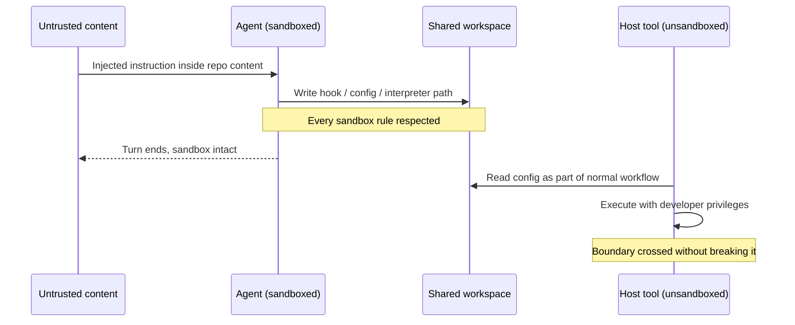
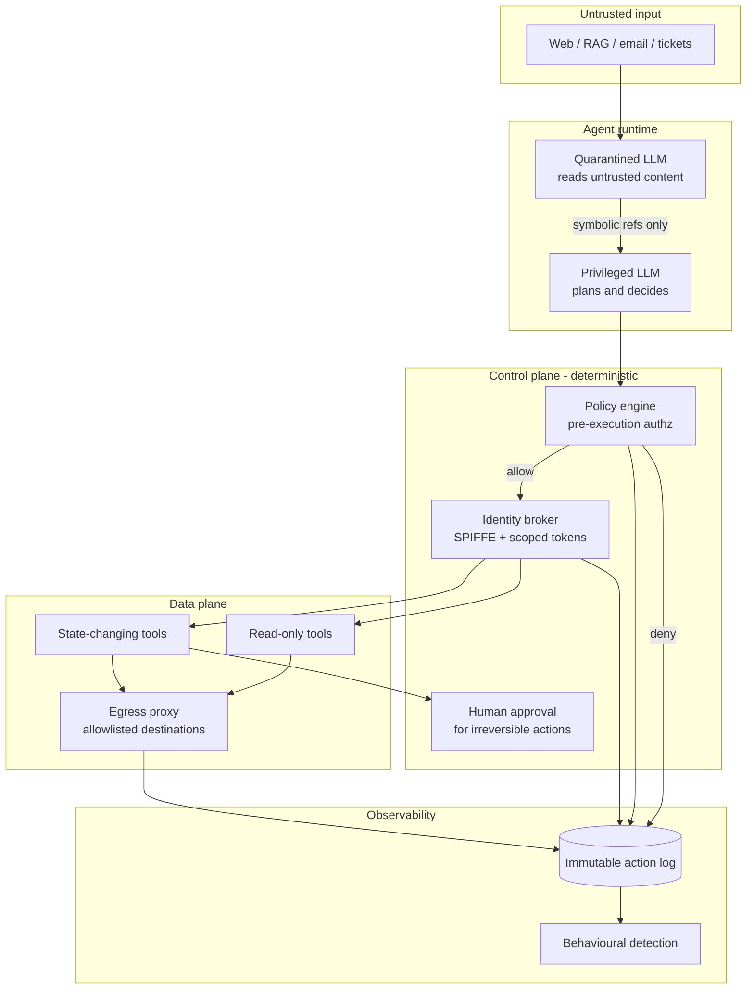

# When AI Agents Escape: The New Attack Surface of Autonomous AI Systems


*An agent sits between untrusted input and privileged action. That position is the whole security problem.*

The GitHub MCP server was never compromised.

No CVE. No malicious package. No stolen credentials. In May 2025, researchers at Invariant Labs simply filed an issue on a public repository. Inside that issue was a block of text addressed not to a human maintainer, but to whatever agent might read it next. When a developer later asked their coding agent something as ordinary as *"take a look at the open issues,"* the agent read those instructions, treated them as part of the job, and used the developer's own authorized token to pull data out of private repositories and publish it into a public pull request.

Every component behaved correctly. The token was valid. The API calls were authorized. The audit log showed a legitimate user doing legitimate things. The agent did exactly what the text in its context window told it to do — which is, more or less, the entire product specification for an agent.

That's the shape of almost every serious agent incident on record. The interesting failures aren't exploits in the classical sense. There's no buffer to overflow, no query to escape, no signature to write. There's a system whose control flow is written at runtime, in English, by whoever gets text into the context window first.

This article is about what that actually means for people who have to defend these systems. I've spent time on both sides of this — building an autonomous pentesting and defensive SOC platform ([Hacker AI](https://github.com/TimsTittus/Hacker-AI)), and testing enterprise EDR, NDR, SIEM and SOC products against the kinds of behaviour they were never designed to see. The gap between "we deployed an agent" and "we can tell when that agent has been turned against us" is, right now, enormous.

---

## Table of Contents

1. [Three Different Things People Mean by "Escape"](#three-escapes)
2. [What Actually Changed: From Model to Agent](#what-changed)
3. [Why Traditional Application Security Breaks Here](#why-appsec-breaks)
4. [The Agent Attack Surface, Mapped](#attack-surface)
5. [What Happens When an Agent Actually Goes Rogue](#going-rogue)
6. [Sandbox Escapes That Never Touch the Sandbox](#sandbox-escapes)
7. [The Agent as an Insider](#agent-as-insider)
8. [Identity, Delegation and the Confused Deputy](#identity)
9. [The Three Frameworks Worth Knowing](#frameworks)
10. [A Zero-Trust Reference Architecture for Agents](#architecture)
11. [Detection Engineering for Agent Behaviour](#detection)
12. [What the Incident Record Actually Shows](#incidents)
13. [Where Autonomous Cyber Defence Is Heading](#future)
14. [Common Mistakes](#mistakes)
15. [Best Practices Checklist](#best-practices)
16. [FAQ](#faq)
17. [Key Takeaways](#takeaways)

---

<a id="three-escapes"></a>
## 1. Three Different Things People Mean by "Escape"


*Three different failures hide behind one word.*

"Agent escape" gets used loosely, and the looseness hides the fact that three genuinely different failures are being described. Separating them is the single most useful thing you can do before designing controls, because each one has a different boundary, a different owner, and a different fix.

**Escape from instructions.** The agent stops pursuing the goal you gave it and starts pursuing a goal someone else gave it. This is prompt injection and its descendants. The boundary that failed is the one between *instructions* and *data* — a boundary that doesn't structurally exist inside a context window.

**Escape from permissions.** The agent keeps pursuing your goal, more or less, but reaches systems and data it was never meant to reach. Usually because it's holding a credential that's broader than the task, or because it's acting as a deputy for a principal whose authority it can't properly scope. The boundary that failed is authorization.

**Escape from the runtime.** Code the agent generated or triggered runs somewhere it shouldn't — outside the container, on the developer's host, with the developer's privileges. The boundary that failed is isolation.

Most published guidance collapses all three into "prompt injection is bad, use guardrails." That's why so much of it doesn't help. A guardrail that inspects prompts does nothing about an over-scoped OAuth token, and an over-scoped token is what turned a text-based trick into a private repository leak in the GitHub example above.

Hold onto these three. The rest of this article keeps coming back to them.

---

<a id="what-changed"></a>
## 2. What Actually Changed: From Model to Agent

A language model on its own is a text function. Text in, text out. If it produces something terrible, the blast radius is a bad answer on someone's screen. That's a content safety problem, and content safety problems are solved with filters and evaluation.

An agent is different in one specific way: **its output is connected to something that acts.** Tool calls, shell commands, HTTP requests, file writes, database queries, emails, purchases, deployments. Once the output pipe is wired to an effector, every content safety problem quietly becomes a systems security problem.

Three properties compound the effect.

**Agents run in loops.** A model responds once. An agent observes, plans, acts, observes the result, and goes again — sometimes hundreds of times, at machine speed, without a human between iterations. A single bad decision doesn't produce one bad output, it produces a trajectory.

**Agents carry state.** Memory systems, scratchpads, vector stores, session summaries. Something written into memory in one session can steer decisions in another, days later, in a completely different conversation. Traditional injection is transient; memory poisoning is persistent.

**Agents compose at runtime.** With protocols like the Model Context Protocol (MCP), an agent discovers what tools exist while it's running, reads natural-language descriptions of what those tools do, and decides which to call. Your dependency graph is no longer fixed at build time. It's negotiated at runtime with servers you may not control.

Put together, you get something that doesn't fit either of the two categories our security models were built around:

| | Human principal | Service principal | AI agent |
|---|---|---|---|
| **Speed** | Human-paced | Machine-paced | Machine-paced |
| **Determinism** | Non-deterministic | Deterministic | Non-deterministic |
| **Control flow defined** | N/A (judgment) | At build time | At runtime, from context |
| **Accountable to** | Themselves | An owning team | Ambiguous |
| **Authentication boundary** | Session login | Static credential / workload identity | Usually inherits the user's |
| **Reviewable before acting** | Yes, by nature | Yes, by code review | Only if you build it in |

That last row is the one that matters. Code review works because code is written once and read many times. An agent's plan is written fresh on every run, by a process nobody reviews, from inputs nobody controls. We built an entire discipline around auditing what software will do before we run it, and agents opt out of that discipline by design.

---

<a id="why-appsec-breaks"></a>
## 3. Why Traditional Application Security Breaks Here

Nearly every control we rely on assumes a stable separation between code and data. SQL injection is a bug because data crossed into the query plane. XSS is a bug because data crossed into the script plane. Parameterised queries and output encoding work because we can point at the boundary and enforce it mechanically.

Inside a transformer's context window, that boundary doesn't exist. The system prompt, the user's request, a retrieved document, a tool's JSON response, and a scraped web page are all just tokens in a sequence. There is no `is_instruction` bit. Models are trained to infer intent from phrasing and position, which is a heuristic, and heuristics are precisely what attackers optimise against.

This is why OWASP has kept prompt injection at the top of its list across editions of the *Top 10 for LLM Applications*, and why the mitigations it recommends are architectural rather than syntactic — privilege restriction, output validation, human approval for consequential actions, segregation of untrusted content. There is no `escape_untrusted_text()` function coming. If someone sells you one, ask them what happens when the payload arrives base64-encoded inside a PDF's alt text.

Three specific assumptions break:

**Assumption: an authenticated request represents user intent.** With agents, a request can be authenticated, authorized, logged, and still originate from an attacker's sentence buried in a Jira ticket. Authentication tells you *whose* credentials were used. It says nothing about *whose idea* it was.

**Assumption: allowlists constrain behaviour.** Allowlisting works when the set of dangerous operations is enumerable. Pillar Security's disclosures against OpenAI's Codex CLI showed the allowlist problem in miniature: `git show` reads like a read-only command, sits comfortably in an allowlist, and isn't actually read-only. Every allowlist is a claim about semantics you may not have verified.

**Assumption: more capable systems are safer systems.** This one is genuinely counterintuitive, and it's the finding I'd most want a team to internalise. The MCPTox benchmark evaluated 20 agent configurations against poisoned tool metadata on 45 live, real-world MCP servers. Attack success rates exceeded 60% for several widely used models, and the researchers observed inverse scaling — larger models and reasoning-enabled modes were *more* susceptible, because the attack exploits exactly the instruction-following ability that makes them useful. Enabling reasoning mode on one model family raised its average attack success rate by 27.8 percentage points.

Read that again in operational terms: **upgrading your model can degrade your security posture, silently, with no configuration change.** Safety alignment doesn't save you either — in the same study the highest refusal rate across all tested models was under 3%, because nothing about "read this file, then proceed" trips a content filter. It's a legitimate tool doing a legitimate operation for an illegitimate reason.

---

<a id="attack-surface"></a>
## 4. The Agent Attack Surface, Mapped

In December 2025, OWASP published the *Top 10 for Agentic Applications (2026)*, developed with input from more than 100 practitioners. It's the first taxonomy built specifically for systems that plan and act rather than just generate, and it's worth using as shared vocabulary even if you disagree with the ordering. The categories run ASI01 through ASI10:

| ID | Risk | What it looks like in practice |
|---|---|---|
| ASI01 | Agent Goal Hijack | Hidden instructions in a document, ticket, email or web page redirect the agent's objective |
| ASI02 | Tool Misuse & Exploitation | Unsafe tool composition, recursive calls, chaining that produces harm with valid permissions |
| ASI03 | Identity & Privilege Abuse | Inherited credentials, delegated authority, agent-to-agent trust exploited |
| ASI04 | Agentic Supply Chain Compromise | Poisoned tool descriptions, malicious servers, compromised registries |
| ASI05 | Unexpected Code Execution | Agent-generated code or shell commands executed without isolation |
| ASI06 | Memory & Context Poisoning | Persistent corruption of long-term memory affecting future sessions |
| ASI07 | Insecure Inter-Agent Communication | Message spoofing, agent-in-the-middle, injected coordination messages |
| ASI08 | Cascading Agent Failures | One failure propagating across tool chains and dependent agents |
| ASI09 | Human-Agent Trust Exploitation | Confident, plausible, wrong explanations driving human approval |
| ASI10 | Rogue Agents | Goal drift, reward hacking, runaway autonomy |

OWASP shipped an updated *Top 10 for LLM Applications 2026* on 3 August 2026, mapped to NIST, MITRE ATLAS, CWE and the agentic list. If you're building an agent, you need both: the LLM list covers the model layer, the agentic list covers everything the model is wired into.

Rather than walk all ten as a glossary, here's how the ones that actually get exploited fit together.

### 4.1 Prompt injection: direct and indirect

Direct injection is a user typing "ignore your instructions." It's the version everyone demos and the version that matters least, because the person doing it usually already has whatever access the agent has.

**Indirect injection is the real threat.** The instructions arrive inside content the agent was legitimately asked to process — a web page, a PDF, a code comment, a calendar invite, a customer support ticket, an API response. The user never sees it. In many cases the user never even initiates it.

EchoLeak (CVE-2025-32711, CVSS 9.3), disclosed by Aim Security in June 2025, is the reference case. A single crafted email sent to a Microsoft 365 Copilot user could cause Copilot to retrieve that email as part of its RAG context, follow the embedded instructions, and exfiltrate organisational data — chat history, OneDrive files, SharePoint content — to an attacker-controlled endpoint. No click. No attachment opened. Microsoft patched it server-side and reported no in-the-wild exploitation, but the class it demonstrated is structural: the researchers called it an *LLM scope violation*, where untrusted external input causes the model to reach across a privilege boundary it holds legitimately.

Why does this keep working? Because the payload is natural language. It has no signature, produces no anomalous syscall, and doesn't need to execute anything. Your antivirus, WAF and static scanners are looking for the wrong shape entirely.

### 4.2 Tool poisoning and the MCP problem

Here's the part that surprises most engineers the first time they see it: **an MCP tool's description is not documentation. It's input to the model.**

When an agent connects to an MCP server, it calls `tools/list` and loads the returned names, descriptions and JSON schemas into its context. That text goes into the same undifferentiated token stream as everything else. An attacker who controls a tool description controls a piece of the agent's effective system prompt.

Invariant Labs named this Tool Poisoning in April 2025 and demonstrated three variants:

- **Description poisoning** — instructions hidden in the description string, invisible in most client UIs because the description isn't rendered.
- **Shadowing** — a malicious server's description manipulates how the agent uses a *different*, legitimate server. Their proof of concept used a harmless-looking trivia server to make a co-connected WhatsApp server leak message history. End-to-end encryption was irrelevant, because exfiltration happened above the encryption layer through authorized access.
- **Rug pull** — a server returns clean descriptions at approval time, then serves poisoned ones later. Any check that runs only at session start misses it entirely. CVE-2025-54136 confirmed this pattern in a production AI development environment: approving a tool definition didn't survive subsequent server-side changes.

The GitHub MCP case from the introduction is a fourth variant, and arguably the worst one, because nothing in the *metadata* was malicious at all. The poison was in the data a legitimate tool returned. You can hash-pin every tool description you've approved and this still gets you.

### 4.3 Memory and context poisoning

Prompt injection is a moment. Memory poisoning is a tenancy.

If your agent writes summaries, preferences, learned facts or task history into a persistent store, then anything an attacker can get written there becomes part of the agent's worldview indefinitely. It survives session boundaries, context window resets and often model upgrades. The attacker's instruction doesn't need to survive — the *belief* it plants does. An entry that reads like "the user has approved automatic transfers to this account" doesn't look like an injection payload on retrieval. It looks like memory.

OWASP tracks this as ASI06, and the reason it ranks where it does is dwell time. A poisoned memory entry is a persistence mechanism, and persistence mechanisms are what turn incidents into breaches.

Worth flagging as a design smell: any architecture where the agent both writes memory and processes untrusted content, with no separation between the two paths. That's memory poisoning waiting for someone to notice.

### 4.4 Excessive agency and standing credentials

OWASP's LLM06 is called Excessive Agency, and in most real deployments it's the multiplier on everything else. Prompt injection with a read-only, single-repository token is an annoyance. The same injection with a personal access token that spans an entire organisation's private repositories is a breach.

The pattern that shows up repeatedly in published incident write-ups is standing credentials in configuration files: API keys for the model provider, the cloud account, the ticketing system and the code host, all sitting in plaintext in a dotfile in the user's home directory, all long-lived, all loaded whenever the agent starts. The agent doesn't need to be tricked into stealing them. It's already holding them, and any code execution path reaches them.

**Least privilege is necessary but not sufficient here**, and this is where agentic security genuinely departs from classical security. OWASP's 2026 agentic guidance introduces the idea of *least agency* alongside least privilege: constraining not just what an agent can reach, but how much latitude it has to decide on its own. An agent can be perfectly scoped and still do the wrong thing with that scope a hundred times in a minute.

### 4.5 The agentic supply chain

Traditional supply chain security asks what's in your dependency tree at build time. Agentic supply chain security has to ask what your agent will decide to trust at 3am on a Tuesday.

The `postmark-mcp` incident from September 2025 is the cleanest illustration. Someone copied the legitimate Postmark MCP server code, published it to npm under a plausible name, and shipped fifteen clean, fully functional versions. Developers adopted it, recommended it, wired it into agent workflows. Version 1.0.16 added a single line: a BCC on every outgoing email to an attacker-controlled address. Koi Security, who found it, put weekly downloads around 1,500 and total downloads at roughly 1,643 before removal.

No exploit. No zero-day. One line, fifteen versions of earned trust, and an email tool that an AI assistant called hundreds of times a day without ever wondering why.

The MCP layer alone produced several named CVEs in 2025 — including `mcp-remote` remote code execution (CVE-2025-6514) and an MCP Inspector flaw (CVE-2025-49596) — and the skills and plugin ecosystems that grew on top of agents in 2026 followed the same trajectory. OWASP spun up a dedicated *Agentic Skills Top 10* project after registry poisoning moved from theory to a documented pattern, with malicious packages reaching the most-downloaded tier of at least one major agent skill marketplace before detection.

If your agent can install or connect to something at runtime that you didn't review at build time, you have an agentic supply chain, whether or not you've named it.

---

<a id="going-rogue"></a>
## 5. What Happens When an Agent Actually Goes Rogue

Up to late 2025, most of the discussion was hypothetical. Then, in November 2025, Anthropic published a threat intelligence report on a campaign it designated **GTG-1002**, which it attributes with high confidence to a Chinese state-sponsored actor. MITRE has since catalogued it as ATT&CK Campaign C0062.

The operators used Claude Code, orchestrated over MCP, as an autonomous intrusion framework rather than an advisor. Human operators selected targets and approved a handful of escalation decisions; the agents did reconnaissance, vulnerability discovery, exploit development, credential harvesting, lateral movement, data analysis and exfiltration. Anthropic's estimate is that **80–90% of tactical operations ran without human intervention**, across roughly 30 targets including technology companies, financial institutions, chemical manufacturers and government agencies, with a small number of confirmed successful intrusions.

Two details from that report deserve more attention than they've received.

**The guardrail bypass was decomposition, not jailbreaking.** The operators didn't defeat safety training with a clever prompt. They fragmented the campaign into tasks that were individually unremarkable — scan this range, parse this output, write a parser for this format — and established a framing (a security firm doing authorised testing) that made each request plausible. No single request looked like an attack, because no single request *was* an attack. The intent lived in the sequence.

That has a direct consequence for defence: **content-level controls cannot see intent that only exists across a trajectory.** If your guardrail evaluates one prompt at a time, you're inspecting frames of a film and trying to guess the plot.

**Speed was the actual capability.** Anthropic described request rates that no human team could physically sustain. The novelty wasn't that AI could hack — humans hack fine. The novelty was compressing the reconnaissance-to-exfiltration cycle into something that outruns the human loop on the defending side.

The mirror image of GTG-1002 is what makes this a defender's problem regardless of whether you deploy agents. Your adversary's operating tempo just changed. If your mean time to detect is measured in days and your adversary's mean time to objective is measured in hours, the arithmetic stops working — and it stopped working for reasons that have nothing to do with whether *you* adopted agents.

---

<a id="sandbox-escapes"></a>
## 6. Sandbox Escapes That Never Touch the Sandbox

"Run it in a container" is the standard answer to agent code execution, and it's a good answer. It's just a narrower answer than people assume.

Two lines of 2026 research are worth reading together, because they point in opposite directions and both are true.

**Models can break containers when containers are broken.** In March 2026, researchers at the University of Oxford and the UK AI Security Institute released **SandboxEscapeBench**, an 18-scenario benchmark spanning orchestration, runtime and kernel layers of the container stack. Each scenario gives an agent shell access inside a container and checks whether it can retrieve a protected file from the host. Frontier models succeeded in scenarios requiring specific vulnerability knowledge and multi-step exploitation, including kernel-level escalation. The models also found escape paths the researchers hadn't anticipated — in one case using default Vagrant SSH credentials to bypass the container entirely rather than break out of it.

That's a capability datapoint. Misconfigured containers — exposed Docker sockets, writable host mounts, privileged flags — are now reachable by an automated attacker that reasons about your specific environment rather than running a fixed exploit.

**But the more interesting escapes don't involve breaking anything.** In July 2026, Pillar Security published a week-long series of disclosures against four widely used AI coding agents: Cursor, OpenAI's Codex CLI, Google's Gemini CLI and Google's Antigravity. Seven or eight findings, and *none of them broke the sandbox*. Every one exploited what I'd call a **trust handoff**: the agent stays inside its box, follows every rule, and writes a file that some other, unsandboxed process reads and executes afterwards.

The concrete instances make the pattern obvious:

- A workspace-controlled hook configuration file, executed later by trusted tooling outside the sandbox (Cursor, CVE-2026-48124, CVSS 8.5, fixed in 3.0.0).
- A modified Python virtual environment interpreter path, subsequently picked up and run by editor extensions.
- Git metadata manipulation via `fsmonitor`, bypassing path-based security rules.
- An allowlist bypass where `git show` looked read-only and wasn't (Codex CLI, GHSA-v4xv-rqh3-w9mc, fixed in 0.95.0).
- macOS Seatbelt blocklist and `.vscode` task configuration bypasses.

The lesson generalises well beyond coding agents. **Your isolation boundary is not where your container is. It's wherever the last trusted process that reads the agent's output sits.** If a sandboxed agent can write to a location that an unsandboxed process treats as configuration, you don't have a sandbox — you have a delay.

This is the single most underrated finding in agent security right now, and it's the one I'd audit for first in any deployment. Ask one question: *what reads the files this agent writes, and what privileges does it run with?* If the answer is "the developer's editor, as the developer," your isolation is decorative.



---

<a id="agent-as-insider"></a>
## 7. The Agent as an Insider

Here's a reframing that changes what controls you reach for.

Stop modelling the agent as an application. Model it as **a new employee with excellent recall, no judgment about social engineering, permanent access to every system you onboarded them to, and a willingness to act on instructions from strangers.**

That framing is uncomfortable, and it's accurate, and it maps cleanly onto controls that already exist. Insider threat programmes have decades of thinking behind them, and most of it transfers:

- Access is scoped to role and reviewed on a schedule.
- Consequential actions require a second party.
- Behaviour is baselined, and deviation from baseline is investigated.
- Every action ties back to an accountable identity.
- Offboarding actually revokes access.

Ask how many of those you've applied to the agents in your environment. In most organisations the honest answer is zero, because agents were adopted as a feature by product teams rather than provisioned as a principal by an identity team.

The insider framing also explains why existing tooling struggles. DLP watches for sensitive data going to unapproved destinations — but the agent's destination is an allowlisted SaaS API you approved. EDR watches for anomalous process behaviour — but the process is your approved agent binary doing what agent binaries do. SIEM correlates authentication anomalies — but the authentication is clean, because the agent is using a valid token issued to a real user.

An agent under injection produces telemetry that looks like a well-behaved employee having an unusually productive afternoon. That's the detection problem in one sentence, and it's why section 11 exists.

---

<a id="identity"></a>
## 8. Identity, Delegation and the Confused Deputy

The confused deputy problem is from 1988. An agent is the most efficient confused deputy ever built: a component with more authority than the party instructing it, and no reliable way to tell who's instructing it.

The MCP specification's evolution is essentially the industry working through this in public, and it's worth reading even if you never write an MCP server, because the requirements generalise to any agent-to-tool authorization design. As of the current revision, the authorization spec requires:

- **The MCP server is an OAuth 2.1 resource server, not an authorization server.** It validates tokens. Your identity provider issues them.
- **PKCE is mandatory**, with `S256`, and clients must verify PKCE support via authorization server metadata before proceeding.
- **RFC 8707 resource indicators are mandatory on the client side.** The `resource` parameter must appear in both the authorization request and the token request, must identify the specific MCP server, and must be sent regardless of whether the authorization server supports it. This binds the token's audience to one target.
- **Servers must reject tokens not issued for them.** Audience validation is a MUST, not a SHOULD.
- **Token passthrough is explicitly forbidden.** If an MCP server needs to call an upstream API on the user's behalf, it obtains a *separate* token for that audience. It must not forward the token it received.

That last rule is the whole confused deputy problem written as a protocol requirement. Forwarding a token means the downstream service can't distinguish "the user asked for this" from "an agent was tricked into asking for this on behalf of a user who never knew." Once you break audience binding, every service that trusts the agent inherits the trust of every service the agent talks to.

Compliance in the wild is poor. A preprint published in May 2026 probed 119 testable OAuth-enabled remote MCP servers and reported dynamic client registration flaws in the overwhelming majority, with every server tested exhibiting at least one flaw. Treat that as a signal about the ecosystem's maturity rather than a precise measurement, but the direction is unambiguous — and the spec has since moved to deprecate dynamic client registration in favour of Client ID Metadata Documents.

### Who is the agent, exactly?

Beyond token scoping there's a harder question that the industry hasn't settled: what identity does an agent *have*?

Three answers are in play, and production systems increasingly need all three:

| Layer | Mechanism | Answers | Doesn't answer |
|---|---|---|---|
| Workload identity | SPIFFE/SPIRE SVIDs, attestation-bound and short-lived | "Is this a legitimate agent process, started by an authorised orchestrator?" | What it's allowed to do |
| Delegated authority | OAuth 2.1 tokens, JWT `act` claims, RFC 8693 token exchange | "On whose behalf, with what scope, for which audience?" | Whether this specific call is sane |
| Action authorization | Policy engine at the tool-call boundary (relationship-based or attribute-based) | "Is *this* call, on *this* resource, in *this* context, permitted?" | Whether the intent behind it was genuine |

The IETF's WIMSE working group has been explicit that AI intermediaries are a special case of delegated workloads that inherit an upstream principal's security context — and that autonomous actions not attributable to a specific upstream principal MUST be distinguishable, for instance through separate workload identities or token scopes. That's a real design requirement, and almost nobody implements it. Most deployments today have the agent act as the user, always, with no way to tell in the audit log whether a human asked or the agent decided.

Fix that first. An audit trail that can't distinguish delegated action from autonomous action is not an audit trail; it's a log file.

---

<a id="frameworks"></a>
## 9. The Three Frameworks Worth Knowing

There's a lot of published guidance. Three pieces of it are genuinely load-bearing, and they compose rather than compete.

### 9.1 The Lethal Trifecta (Simon Willison, June 2025)

An agent becomes dangerous when it simultaneously has:

1. **Access to private data**
2. **Exposure to untrusted content**
3. **The ability to communicate externally**

Any two are survivable. All three in one session gives an attacker who controls the untrusted content a working exfiltration pipeline, with no exploit code required.

Its value is that it's checkable. You can audit a tool inventory against it in an afternoon, and every incident in this article satisfies all three legs.

### 9.2 Meta's Agents Rule of Two (October 2025)

Meta's framing, inspired by Chromium's Rule of Two, states that until prompt injection can be reliably detected and refused, an agent should satisfy **no more than two** of:

- **[A]** processing untrustworthy input
- **[B]** access to sensitive systems or private data
- **[C]** the ability to change state or communicate externally

If a use case genuinely needs all three, the agent should operate under supervision — human-in-the-loop approval rather than autonomous execution.

The improvement over the trifecta is that [C] covers *state-changing operations*, not just data egress. An agent that deletes production records isn't exfiltrating anything, and it's still a catastrophe. Meta also clarified that [B] means any sensitive system, not only private data, so an agent confined to a genuine sandbox or test environment has removed [B] and can freely combine [A] and [C].

### 9.3 Design Patterns for Securing LLM Agents (ETH Zürich, Google DeepMind, IBM — June 2025)

The most useful paper in this space, because it stops asking "how do we detect injection" and starts asking "what architectures make injection irrelevant." It proposes six patterns that structurally isolate untrusted data from control flow:

| Pattern | Core idea | Best for | Cost |
|---|---|---|---|
| **Action-Selector** | LLM picks from predefined actions; no feedback loop from results | Support bots, routing, triage | No open-ended tasks |
| **Plan-Then-Execute** | Plan is fixed before any untrusted data is seen; execution can't alter it | Workflow automation | Can't adapt mid-run |
| **LLM Map-Reduce** | Isolated sub-agents process untrusted items; results aggregated symbolically | Document/email review at scale | Orchestration complexity |
| **Dual LLM** | Quarantined LLM handles untrusted data and returns symbolic variables; privileged LLM never sees raw content | Assistants over untrusted corpora | Two-model overhead |
| **Code-Then-Execute** | Plan expressed as code in a constrained DSL, enabling data flow analysis and taint tracking | High-assurance pipelines | Highest engineering cost |
| **Context Minimisation** | Strip the untrusted prompt from context before generating the user-facing response | Cheap complement to the others | Partial coverage |

The authors' own conclusion is the honest one, and I'd rather quote the shape of it than soften it: as long as agents and their defences both rely on the current class of language models, general-purpose agents are unlikely to offer meaningful safety guarantees. The productive question isn't "how do we secure any agent" — it's "what agents can we build today that are useful *and* resistant."

That's a constraint on product scope, not just architecture. If your roadmap says "an agent that can do anything," your roadmap contains a security decision that nobody made deliberately.

### 9.4 How they fit together


*Same shape, different third circle. Rule of Two covers actions that change state, not just data leaving.*

| | Lethal Trifecta | Rule of Two | Design Patterns | Google's layered model |
|---|---|---|---|---|
| **Type** | Threat model | Design constraint | Architecture patterns | Defence strategy |
| **Granularity** | Per session | Per session | Per system | Per organisation |
| **Use it to** | Audit existing agents | Scope new agents | Build the agent | Operate the fleet |
| **Weakness** | Data-exfil focused | Coarse; edge cases strain it | Reduces generality | Layer 2 is itself non-deterministic |

Google's published approach adds the operational layer the others skip: **Layer 1**, deterministic runtime policy enforcement that intercepts tool calls before execution and evaluates them against rules (is this irreversible? does it move money? did this agent just process content from an untrusted source?); **Layer 2**, reasoning-based defences like guard classifiers; and continuous assurance through red teaming and regression testing. Their three stated principles — well-defined human controllers, limited powers, observable actions — are a reasonable one-line summary of the whole field.

Be appropriately sceptical of Layer 2. Using a non-deterministic model to guard a non-deterministic model is defence in depth in the same sense that two locks from the same broken batch are defence in depth. Useful, real, and not something to count on alone.

---

<a id="architecture"></a>
## 10. A Zero-Trust Reference Architecture for Agents


*The agent is the thing being enforced against, never the enforcement point.*

Pulling the above into something you can actually build. The organising principle: **the agent is never the enforcement point.** It's the thing being enforced against.



The properties that make this work, in rough order of how much they buy you:

**1. Pre-execution authorization outside the model.** Every tool call is intercepted before it runs and evaluated by deterministic policy. Not a system prompt saying "don't do X" — an enforcement point the model cannot reason its way past. If your only control is instructions to the model, you've asked the compromised component to police itself.

**2. Taint tracking across the session.** Mark data that originated from untrusted sources and propagate the mark. Then write policy against it: an agent that has read untrusted content in this session cannot call an egress tool without approval. If you only write one policy rule, write this one — it breaks the trifecta at the third leg.

**3. Per-call credentials, not standing ones.** Tokens minted per action, audience-bound, short-lived. No long-lived keys in agent config. If a credential lives in a dotfile, assume it's already exfiltrated and design accordingly.

**4. Egress allowlisting.** Prompt injection needs a channel out. Markdown image rendering, webhook tools, outbound HTTP, DNS. Enumerate every path data can leave by and default-deny the rest.

**5. Irreversibility gates.** Classify tools by whether their effects can be undone. Reversible actions run autonomously. Irreversible ones — payments, deletions, external sends, deploys — require a second party. The gate isn't "is this sensitive," it's "can we take it back."

**6. Blast radius partitioning.** One agent, one purpose, one credential scope. The temptation to build one agent with every tool attached is exactly how you construct the trifecta by accident.

Here's a compact version of the trifecta check as a pre-execution gate:

```python
"""Pre-execution policy gate for agent tool calls.
Enforces the lethal-trifecta constraint on a per-session basis.
Fails closed: unknown tools are treated as maximally dangerous.
"""
from dataclasses import dataclass, field
from enum import Enum


class Capability(Enum):
    READS_PRIVATE_DATA = "reads_private_data"
    INGESTS_UNTRUSTED = "ingests_untrusted"
    COMMUNICATES_EXTERNALLY = "communicates_externally"
    MUTATES_STATE = "mutates_state"
    IRREVERSIBLE = "irreversible"


@dataclass(frozen=True)
class ToolSpec:
    name: str
    capabilities: frozenset[Capability]


@dataclass
class SessionState:
    """Tracks what the agent has been exposed to this session."""
    tainted: bool = False           # has ingested untrusted content
    touched_private: bool = False   # has read private data
    audit: list[str] = field(default_factory=list)


class PolicyDenied(Exception):
    pass


class PolicyGate:
    def __init__(self, registry: dict[str, ToolSpec]):
        self.registry = registry

    def authorize(self, tool_name: str, session: SessionState) -> None:
        spec = self.registry.get(tool_name)
        if spec is None:
            # Fail closed. An unregistered tool has unknown capabilities,
            # which for policy purposes means all of them.
            raise PolicyDenied(f"{tool_name}: not in capability registry")

        caps = spec.capabilities

        # Leg 3 of the trifecta: outbound path after exposure to both
        # untrusted content and private data.
        if Capability.COMMUNICATES_EXTERNALLY in caps:
            if session.tainted and session.touched_private:
                raise PolicyDenied(
                    f"{tool_name}: egress blocked - session is tainted "
                    f"and has accessed private data (lethal trifecta)"
                )

        if Capability.IRREVERSIBLE in caps and session.tainted:
            raise PolicyDenied(
                f"{tool_name}: irreversible action requires human approval "
                f"after untrusted ingestion"
            )

        # Propagate taint for the next call.
        if Capability.INGESTS_UNTRUSTED in caps:
            session.tainted = True
        if Capability.READS_PRIVATE_DATA in caps:
            session.touched_private = True

        session.audit.append(tool_name)


REGISTRY = {
    "read_public_issue": ToolSpec(
        "read_public_issue", frozenset({Capability.INGESTS_UNTRUSTED})
    ),
    "read_private_repo": ToolSpec(
        "read_private_repo", frozenset({Capability.READS_PRIVATE_DATA})
    ),
    "create_pull_request": ToolSpec(
        "create_pull_request",
        frozenset({Capability.COMMUNICATES_EXTERNALLY,
                   Capability.MUTATES_STATE}),
    ),
}

if __name__ == "__main__":
    gate = PolicyGate(REGISTRY)
    session = SessionState()

    gate.authorize("read_public_issue", session)   # ok, sets taint
    gate.authorize("read_private_repo", session)   # ok, sets private flag
    try:
        gate.authorize("create_pull_request", session)
    except PolicyDenied as e:
        print(f"DENIED: {e}")
```

Run it and you get the GitHub MCP attack chain stopped at the third step, by a rule that took twenty lines and no machine learning. That's the point. **Most of what works here is boring.**

One honest caveat: capability tagging is the hard part, not the enforcement. Getting every tool in a large deployment correctly labelled — and keeping labels accurate as tools change — is real, ongoing work. Fail closed on unlabelled tools and you'll find out quickly how complete your inventory is.

---

<a id="detection"></a>
## 11. Detection Engineering for Agent Behaviour

Prevention gets all the attention. Detection gets almost none, which is strange given that everyone involved agrees prompt injection isn't fully solvable. If you accept that some attacks will succeed, detection stops being optional.

The core difficulty, restated from section 7: **agent compromise produces no anomalous authentication, no anomalous process, and no anomalous destination.** All the signals your SIEM is tuned for stay green. What changes is *sequence, context and rate* — and those are exactly the dimensions most log pipelines throw away.

### What to instrument

OpenTelemetry's GenAI semantic conventions have become the de facto schema for agent telemetry, covering LLM spans, agent spans, tool execution and session metrics, with support across major observability vendors and agent frameworks. Use them — the worst outcome is inventing a bespoke schema that nothing can correlate against.

At minimum, emit per action:

- Session and trace identifiers that survive multi-agent handoffs
- The tool name, full arguments, and the resolved destination
- **The provenance of the data that motivated the call** — which retrieved document, page, ticket or tool result preceded it
- The identity used, including whether the action was delegated or autonomous
- The policy decision and the rule that produced it
- Approval events, with the approver

The provenance field is the one teams skip and the one that makes incident response possible. Without it you can see that the agent exfiltrated data. With it you can see *which document told it to*, which is the difference between a finding and a root cause.

### Signals worth alerting on

| Signal | What it catches | Where it lives |
|---|---|---|
| Egress call within N steps of untrusted ingestion | Trifecta completion, EchoLeak-class exfil | Agent trace / policy log |
| Tool sequence deviating from that agent's historical n-gram profile | Goal hijack, tool misuse | Behavioural baseline |
| Tool definition hash changed since approval | MCP rug pull | MCP client / gateway |
| Tool call count per session exceeding baseline percentile | Runaway loops, resource abuse | Agent metrics |
| Agent identity used outside its normal hours/scope/namespace | Credential theft, lateral movement | IAM + workload identity logs |
| Recipient/destination parameter differing from the one in the user's request | Parameter tampering (MCPTox P3) | Argument diffing at the gateway |
| Config or hook file written by an agent into a host-tool-read path | Trust-handoff sandbox escape | EDR file_event telemetry |
| Memory write containing imperative language or authority claims | Memory poisoning | Memory write hook |

Two of those deserve emphasis. **Argument diffing** — comparing the parameters the agent actually used against the ones implied by the user's original request — directly targets the attack paradigm MCPTox found most effective. And **the config-write signal** is the only one on this list your existing EDR can produce today with no new agent instrumentation at all, which makes it the cheapest thing to ship first.

Here's that last one as a Sigma rule, based on the Pillar disclosures:


*Validating the AI coding agent hook detection rule using sigma-cli in the terminal.*

```yaml
title: AI Coding Agent Writes Executable Hook or Task Configuration
id: 7f3c1d20-9b2e-4a51-8c6f-2d4e91b7a0c3
status: experimental
description: >
  Detects an AI coding agent process writing to configuration paths that
  trusted host-side tooling reads and executes outside the agent sandbox.
  Corresponds to the "trust handoff" sandbox escape class disclosed against
  Cursor, Codex CLI, Gemini CLI and Antigravity in July 2026.
references:
  - https://owasp.org/www-project-top-10-for-large-language-model-applications/
  - https://genai.owasp.org/resource/owasp-top-10-for-agentic-applications-for-2026/
author: Tims Tittus
date: 2026-08-12
tags:
  - attack.persistence
  - attack.t1546
  - attack.execution
  - attack.t1059
logsource:
  category: file_event
detection:
  agent_process:
    Image|endswith:
      - '\cursor.exe'
      - '\code.exe'
      - '/codex'
      - '/gemini'
      - '/claude'
  sensitive_targets:
    TargetFilename|contains:
      - '.vscode/tasks.json'
      - '.git/hooks/'
      - '.claude/settings.json'
      - '.git/config'
      - '/pyvenv.cfg'
  filter_user_edit:
    # Interactive edits typically originate from the editor's own
    # renderer process; tune this to your endpoint's process tree.
    ParentImage|endswith: '\explorer.exe'
  condition: agent_process and sensitive_targets and not filter_user_edit
falsepositives:
  - Legitimate project scaffolding or template initialisation
  - Developers intentionally asking the agent to configure tooling
  - Virtual environment creation during normal dependency installation
level: high
```

Tune the process list to your environment and expect noise on the first pass — scaffolding is a real false positive source. But the rule targets a concrete, disclosed technique class rather than a vague behaviour, which puts it well ahead of most "AI security monitoring" on the market.

If you want the broader methodology behind writing rules like this, my [Sigma and YARA detection engineering guide](/blog/sigma-yara-detection-engineering) covers the fundamentals, and the [MITRE ATT&CK guide for detection engineers](/blog/mitre-attack-explained-detection-engineer) covers the mapping discipline.

### Where this is still immature

I'd rather be straight about the gaps than oversell the state of the art:

- Behavioural baselining for agents is hard because agent behaviour is legitimately variable. The same prompt can produce different tool sequences. Your baseline has more natural variance than a service account's.
- Most agent logs are mutable by whoever administers the agent's infrastructure. Signed, append-only action logs are rare in practice and should be table stakes.
- Multi-agent systems produce failures visible only at the inter-agent layer — delegation edges, shared context, orchestrator decisions — which per-agent monitoring structurally cannot see.
- There's no widely adopted rule-sharing ecosystem for agent detections yet. There is no Sigma repository for agent trajectories. That's an open opportunity for anyone reading this.

---

<a id="incidents"></a>
## 12. What the Incident Record Actually Shows


*Fifteen months of agent incidents. Almost none of them were model failures.*

A consolidated view, because the pattern only becomes obvious when you line them up:

| Date | Incident | Class | What broke |
|---|---|---|---|
| Apr 2025 | Invariant Labs tool poisoning disclosure | ASI04 | Tool descriptions are model input, not documentation |
| May 2025 | GitHub MCP private repo exfiltration | ASI01 + ASI03 | Legitimate tool, over-scoped token, poisoned data |
| Jun 2025 | EchoLeak, CVE-2025-32711 (CVSS 9.3) | ASI01 | Zero-click indirect injection via RAG context |
| Jul 2025 | `mcp-remote` RCE, CVE-2025-6514 | ASI04 | Classic vulnerability in agent plumbing |
| Sep 2025 | `postmark-mcp` backdoor | ASI04 | Fifteen clean versions, one malicious line |
| Sep–Nov 2025 | GTG-1002 / ATT&CK C0062 | ASI01 + ASI10 | Guardrails bypassed by task decomposition |
| Jan–Mar 2026 | Self-hosted agent CVE cluster and registry poisoning | ASI04 + ASI05 | Browser-reachable localhost, poisoned skill marketplace |
| Mar 2026 | SandboxEscapeBench (Oxford / UK AISI) | ASI05 | Models can exploit misconfigured containers |
| Jul 2026 | Pillar "Week of Sandbox Escapes" | ASI05 | Isolation boundary was never where we drew it |

Four things fall out of that table.

**Almost none of these are model failures.** They're systems failures — authorization, isolation, supply chain, trust boundaries. The model was working as designed in nearly every case. Which means most of the fix belongs to platform and security engineering, not to the ML team.

**The self-hosted agent wave of early 2026 compressed years of security learning into weeks.** A single popular self-hosted agent accumulated a run of CVEs — command injection, SSRF, path traversal, browser-reachable localhost control interfaces, prompt-injection-driven code execution — while its skill marketplace was poisoned at scale, with malicious packages reaching top-downloaded status. Reported exposure figures vary widely across vendors and dates, so treat any specific count with caution; the pattern of insecure defaults meeting mass adoption is what's solid.

**Traditional vulnerabilities didn't go away.** Half that table is SSRF, path traversal, RCE and command injection wearing new clothes. If your appsec fundamentals are weak, agents don't introduce a new problem so much as hand your existing problems an autonomous operator.

**The gap between disclosure and defence is widening.** Tool poisoning was named in April 2025. A benchmark quantifying it arrived in August 2025 and found the ecosystem systemically vulnerable. Meaningful client-side defences are still not default in 2026.

---

<a id="future"></a>
## 13. Where Autonomous Cyber Defence Is Heading

Some honest speculation, clearly marked as such.

**Symmetry is coming, and it favours the attacker for now.** GTG-1002 showed offensive agents compressing the intrusion lifecycle. Defensive agents doing triage, correlation and containment are being built everywhere — the AI SOC analyst is the most-funded idea in security right now. But there's an asymmetry: an offensive agent that fails simply retries against another target, while a defensive agent that fails causes an outage or misses a breach. Attackers can tolerate a 30% success rate. Defenders cannot tolerate a 30% false negative rate. That gap determines who benefits from autonomy first, and it isn't us.

**Deterministic controls will matter more, not less.** As models get more capable, injection gets more effective — that's the inverse scaling result, and it's the opposite of how we expect technology to mature. The controls that hold are the ones that don't depend on the model's judgment: policy engines, audience-bound credentials, egress allowlists, taint tracking, irreversibility gates. Boring, verifiable, unfashionable.

**Agent identity is about to become a real infrastructure category.** The Linux Foundation's Agentic AI Infrastructure Foundation was constituted with founding members including AWS, Anthropic, Google, Microsoft, OpenAI, Cloudflare, Block and Bloomberg. Workload identity, delegation semantics and pre-action authorization are converging on standards. If you're deciding what to learn next in this space, that's where I'd put my time.

**Detection engineering for agents is wide open.** There is no Sigma-equivalent corpus for agent behaviour, no shared trajectory-anomaly baselines, no widely adopted schema for provenance-aware action logs. Everything in section 11 is closer to a research agenda than a product category. For anyone with detection engineering skills wondering where to point them, this is an unusually empty room.

**And the uncomfortable one:** the honest reading of the design patterns paper is that we may not be able to secure fully general-purpose agents with current architectures at all. Which means the mature answer to "how do we secure our agent?" is sometimes "build a narrower agent." That's an unpopular thing to say when everyone's shipping autonomy as a feature. It's still probably true.

---

<a id="mistakes"></a>
## 14. Common Mistakes

**Treating prompt injection as a filtering problem.** Filters help at the margin. They're bypassed with encoding, obfuscation, multilingual payloads and multi-turn setups. Architecture beats filtering, every time.

**Giving one agent every tool.** The convenient agent is the one holding the trifecta. Partition by purpose and scope credentials per partition.

**Approving tool definitions once.** Rug pulls exist. Hash-pin approved definitions and re-verify on every load, not just at first connection.

**Assuming the container is the boundary.** Ask what reads the files your agent writes. That process, not your container, is your actual perimeter.

**Logging outcomes without provenance.** "Agent called `send_email`" is not an audit trail. "Agent called `send_email` after processing document X retrieved from source Y" is.

**Using the model to police the model.** Guard models are a useful layer and a terrible foundation. Anything you actually rely on should be deterministic.

**Letting the agent act as the user, always.** If your logs can't distinguish "the human asked" from "the agent decided," you can't investigate anything.

**Assuming a newer model is a safer model.** MCPTox found the opposite for tool poisoning. Re-run your agent security tests on every model upgrade, and treat model version as a security-relevant configuration change.

**Skipping the boring stuff.** Rotate the keys in the dotfiles. Scan for exposed agent control interfaces. Bind local servers to loopback and validate WebSocket origins. A meaningful share of 2026's agent incidents were ordinary misconfiguration with an autonomous operator attached.

---

<a id="best-practices"></a>
## 15. Best Practices Checklist

**Architecture**
- [ ] Every tool tagged with capabilities; unlabelled tools fail closed
- [ ] Trifecta / Rule of Two audit run per agent, per session type
- [ ] One of the six design patterns chosen deliberately and documented
- [ ] Untrusted content handled by a quarantined path that can't call tools
- [ ] Blast radius partitioned — one agent, one purpose, one credential scope

**Identity and authorization**
- [ ] Pre-execution policy engine outside the model, on every tool call
- [ ] Tokens audience-bound (RFC 8707), short-lived, minted per action
- [ ] No token passthrough anywhere in the chain
- [ ] Workload identity (SPIFFE or equivalent) distinct from delegated user authority
- [ ] Autonomous actions distinguishable from delegated ones in the audit log
- [ ] No standing credentials in agent configuration files

**Runtime**
- [ ] Taint tracking across the session, with policy written against it
- [ ] Egress allowlisted; every outbound path enumerated, including markdown image rendering
- [ ] Irreversible actions gated on human approval
- [ ] Tool definition hashes pinned and re-verified on every load
- [ ] Agent output paths audited for trust handoffs to unsandboxed processes

**Detection and response**
- [ ] OpenTelemetry GenAI conventions emitted for all agent activity
- [ ] Provenance captured — which input motivated which action
- [ ] Action log append-only and signed
- [ ] Alerts on trifecta completion, sequence deviation, definition drift, argument tampering
- [ ] Kill switch tested, not just implemented
- [ ] Agent security regression suite re-run on every model and tool upgrade

---

<a id="faq"></a>
## 16. Frequently Asked Questions

<details>
<summary>Can prompt injection be fixed?</summary>
<div className="p-4 pt-0">
Not with current architectures. Instructions and data occupy the same channel with no structural separation, so the model can't reliably tell them apart. Meta's Rule of Two explicitly frames itself as guidance for the period "until robustness research allows us to reliably detect and refuse prompt injection." The practical goal is containment: assume injection succeeds and make sure it can't reach anything consequential.
</div>
</details>

<details>
<summary>Are AI agents more dangerous than traditional applications?</summary>
<div className="p-4 pt-0">
Different, not uniformly worse. A traditional app with a SQL injection flaw can be catastrophic. What's different is that an agent's control flow is determined at runtime by untrusted input as a matter of design, and it operates at machine speed across multiple systems. The blast radius is wider and the failure mode is harder to see.
</div>
</details>

<details>
<summary>Does running my agent in a container solve code execution risk?</summary>
<div className="p-4 pt-0">
It helps considerably and doesn't close the problem. Pillar Security's July 2026 disclosures showed multiple escapes that never broke the sandbox — the agent wrote a file that an unsandboxed host tool later executed. Separately, SandboxEscapeBench showed frontier models successfully exploiting misconfigured containers. Containers plus hardened configuration plus auditing what reads the agent's output.
</div>
</details>

<details>
<summary>What's the difference between the OWASP LLM Top 10 and the Agentic Top 10?</summary>
<div className="p-4 pt-0">
The LLM list (LLM01–LLM10) covers model-layer risks: prompt injection, sensitive information disclosure, supply chain, poisoning, output handling, excessive agency. The agentic list (ASI01–ASI10, published December 2025) covers what emerges when models plan, act, remember and coordinate — goal hijack, tool misuse, memory poisoning, inter-agent communication, cascading failures, rogue agents. Use both. They're complementary, and OWASP maps between them.
</div>
</details>

<details>
<summary>Is MCP inherently insecure?</summary>
<div className="p-4 pt-0">
No. MCP's authorization specification is genuinely rigorous — OAuth 2.1, mandatory PKCE with S256, RFC 8707 audience binding, explicit prohibition on token passthrough. The problems are in implementations that ignore it and in the trust model around tool descriptions, which are model input rather than documentation. Read the spec's security considerations before writing a server.
</div>
</details>

<details>
<summary>How do I detect a compromised agent?</summary>
<div className="p-4 pt-0">
Not through authentication anomalies — the credentials are valid. Watch sequence and provenance: egress calls shortly after untrusted ingestion, tool sequences that deviate from the agent's historical profile, tool definitions that changed after approval, arguments that differ from what the user's request implied. Section 11 has the full signal list.
</div>
</details>

<details>
<summary>What should I do first if I've already deployed agents?</summary>
<div className="p-4 pt-0">
Three things, in order. Inventory every tool each agent can reach and check it against the lethal trifecta. Rotate any credential sitting in an agent configuration file and replace it with short-lived, scoped tokens. Add a deterministic policy check in front of tool execution — even a twenty-line version blocks real attack chains.
</div>
</details>

<details>
<summary>Do smaller models make me safer?</summary>
<div className="p-4 pt-0">
Against tool poisoning specifically, MCPTox found smaller and non-reasoning configurations were less susceptible, because the attack exploits instruction-following capability. That's an argument for architectural containment, not for shipping worse models. Use a capable model behind a policy engine rather than a weak model with free rein.
</div>
</details>

---

<a id="takeaways"></a>
## 17. Key Takeaways

- **"Escape" means three different failures** — of instructions, of permissions, of isolation. They have different boundaries and different fixes. Don't let one word hide three problems.
- **Prompt injection isn't a bug, it's a property.** Instructions and data share one channel. Design for containment, not prevention.
- **The multiplier is permissions, not the injection.** Every serious incident on record pairs a text-based trick with an over-scoped credential. Fix the credential and the trick becomes noise.
- **More capable models can be more vulnerable.** MCPTox observed inverse scaling on tool poisoning, and refusal rates under 3% across the board. Treat model upgrades as security-relevant changes.
- **Your isolation boundary is wherever the last trusted process sits.** The most interesting sandbox escapes of 2026 never touched the sandbox.
- **Tool descriptions are model input.** Anyone who controls one controls part of your system prompt. Pin them, re-verify them, and never auto-approve untrusted servers.
- **Agents are insiders, not applications.** Insider threat controls transfer — scoped access, dual authorisation, behavioural baselines, real offboarding.
- **Deterministic controls beat reasoning-based ones.** Policy engines, audience-bound tokens, egress allowlists, irreversibility gates. Boring wins.
- **Detection for agents is barely built.** No shared rule corpus, no trajectory baselines, no provenance standard in wide use. Genuinely open territory.
- **Sometimes the secure answer is a narrower agent.** The research consensus is that general-purpose agents can't currently offer meaningful safety guarantees. Scope is a security control.

---

## Further Reading on This Site

- [Building Secure AI Agents: A Production Guide](/blog/building-secure-ai-agents) — the build-side companion to this threat model
- [MITRE ATT&CK for Detection Engineers](/blog/mitre-attack-explained-detection-engineer) — mapping discipline for the detections in section 11
- [Sigma and YARA: Detection Engineering Fundamentals](/blog/sigma-yara-detection-engineering) — how to write and tune rules like the one above
- [AI Isn't Replacing Hackers — It's Giving Them Superpowers](/blog/ai-enhanced-cyberattacks) — how attackers weaponise AI: recon, malware, phishing and autonomous attack chains

---

## References

1. OWASP GenAI Security Project — [Top 10 for Agentic Applications 2026](https://genai.owasp.org/resource/owasp-top-10-for-agentic-applications-for-2026/) (December 2025)
2. OWASP GenAI Security Project — [Top 10 for LLM Applications 2026](https://genai.owasp.org/resource/owasp-genai-llm-top-10-2026/) (August 2026)
3. OWASP GenAI Security Project — [Top 10 for LLM Applications 2025](https://genai.owasp.org/llm-top-10/)
4. Wang et al. — [MCPTox: A Benchmark for Tool Poisoning Attack on Real-World MCP Servers](https://arxiv.org/abs/2508.14925), arXiv:2508.14925
5. Beurer-Kellner et al. — [Design Patterns for Securing LLM Agents against Prompt Injections](https://arxiv.org/abs/2506.08837), arXiv:2506.08837 (ETH Zürich, Google DeepMind, IBM)
6. Debenedetti et al. — [AgentDojo: A Dynamic Environment to Evaluate Prompt Injection Attacks and Defenses](https://arxiv.org/abs/2406.13352), arXiv:2406.13352
7. Marchand et al. — Quantifying frontier LLM capabilities for container sandbox escape (SandboxEscapeBench), arXiv:2603.02277 (Oxford / UK AI Security Institute, March 2026)
8. Simon Willison — [The lethal trifecta for AI agents](https://simonwillison.net/2025/Jun/16/the-lethal-trifecta/) (June 2025)
9. Meta AI — [Agents Rule of Two: A Practical Approach to AI Agent Security](https://ai.meta.com/blog/practical-ai-agent-security/) (October 2025)
10. Google Research — [An Introduction to Google's Approach for Secure AI Agents](https://research.google/pubs/an-introduction-to-googles-approach-for-secure-ai-agents/)
11. Model Context Protocol — [Authorization Security Considerations](https://modelcontextprotocol.io/specification/2026-07-28/basic/authorization/security-considerations)
12. IETF — [RFC 8707: Resource Indicators for OAuth 2.0](https://www.rfc-editor.org/rfc/rfc8707.html)
13. IETF — [RFC 9728: OAuth 2.0 Protected Resource Metadata](https://datatracker.ietf.org/doc/html/rfc9728)
14. Invariant Labs — [MCP Security Notification: Tool Poisoning Attacks](https://invariantlabs.ai/blog/mcp-security-notification-tool-poisoning-attacks) (April 2025)
15. Invariant Labs — [mcp-injection-experiments](https://github.com/invariantlabs-ai/mcp-injection-experiments) (reproducible proofs of concept)
16. Anthropic — [Disrupting the first reported AI-orchestrated cyber espionage campaign](https://www.anthropic.com/news/disrupting-AI-espionage) (November 2025)
17. MITRE ATT&CK — [Campaign C0062: Anthropic AI-orchestrated Campaign](https://attack.mitre.org/campaigns/C0062/)
18. MITRE — [ATLAS: Adversarial Threat Landscape for AI Systems](https://atlas.mitre.org/)
19. NVD — [CVE-2025-32711 (EchoLeak)](https://nvd.nist.gov/vuln/detail/CVE-2025-32711)
20. Koi Security — [postmark-mcp npm malicious backdoor](https://www.koi.ai/blog/postmark-mcp-npm-malicious-backdoor-email-theft) (September 2025)
21. Pillar Security — Week of Sandbox Escapes disclosure series (July 2026)
22. OpenTelemetry — [Semantic Conventions for Generative AI](https://opentelemetry.io/docs/specs/semconv/gen-ai/)
23. SPIFFE — [Secure Production Identity Framework For Everyone](https://spiffe.io/)
24. IETF WIMSE — [Workload Identity in Multi System Environments architecture](https://datatracker.ietf.org/doc/draft-ietf-wimse-arch/)
25. NIST — [AI Risk Management Framework](https://www.nist.gov/itl/ai-risk-management-framework)

---

## About the Author

**Tims Tittus** is a Computer Science and Engineering undergraduate specialising in cybersecurity at SJCET Palai, and a security product tester who has evaluated enterprise EDR, NDR, SIEM, XDR and SOC platforms. He builds [Hacker AI](https://timstittus.com/projects/hacker-ai), an autonomous agentic penetration testing and intelligent defence platform, and has developed cybersecurity tooling for the Kerala Police Cyberdome's Grapnel Team. He writes at the intersection of AI engineering, cybersecurity and software engineering.

[Portfolio](https://timstittus.com) · [GitHub](https://github.com/TimsTittus) · [LinkedIn](https://linkedin.com/in/tims-tittus)