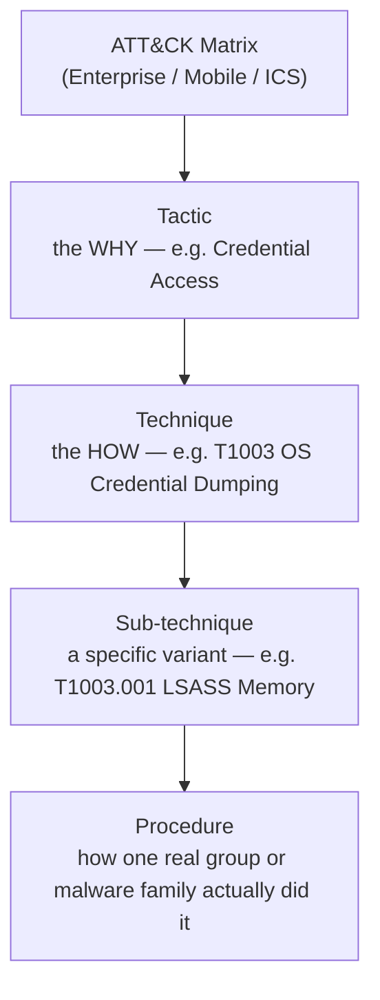
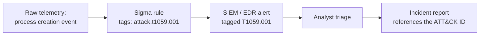

# MITRE ATT&CK Explained: Reading the Matrix Like a Detection Engineer


*Reading the matrix is a skill — this guide covers how to actually use it.*

Every SOC has a version of this moment: an EDR alert pops up tagged `T1055.012`, and whoever's on shift has no idea what that means beyond "probably bad." They paste it into Google, land on attack.mitre.org, and hit a dense, color-coded grid that looks like nobody bothered to format the spreadsheet. For a lot of people, that's the entire relationship they'll ever have with MITRE ATT&CK — a lookup table you check when an alert throws a strange code at you.

That's a shame, because ATT&CK was never built to be a glossary. It's worth remembering that it started as a single internal spreadsheet at MITRE before it grew into something referenced in cybersecurity programs in well over 100 countries. The point was to give attackers and defenders a shared vocabulary for adversary behavior. Once you understand how the matrix is actually organized — not just what it looks like on the page — technique IDs stop being cryptic strings and start being genuinely useful signal.

This is also a strange time to be writing about ATT&CK, because the matrix changed in a pretty fundamental way a few months ago, and a lot of existing explainers on this topic haven't caught up yet. So beyond the fundamentals, I want to walk through what's actually different right now, and how detection engineers — the people who have to turn this knowledge base into working alert logic — use it in practice.

## Table of Contents

1. [What MITRE ATT&CK Actually Is (And Isn't)](#what-mitre-attck-actually-is)
2. [The Building Blocks: Tactics, Techniques, and Sub-Techniques](#the-building-blocks)
3. [What Just Changed: The Defense Evasion Split (v19)](#what-just-changed)
4. [Walking the Current Enterprise Matrix](#walking-the-matrix)
5. [How Detection Engineers Actually Use ATT&CK](#how-detection-engineers-use-it)
6. [From Technique ID to Detection Rule: A Worked Example](#worked-example)
7. [The Ecosystem Around ATT&CK: Navigator, D3FEND, and Threat-Informed Defense](#the-ecosystem)
8. [Common Mistakes Teams Make With ATT&CK](#common-mistakes)
9. [Best Practices for Threat-Informed Defense](#best-practices)
10. [ATT&CK vs. Cyber Kill Chain vs. Diamond Model](#comparison)
11. [Where AI Fits Into the Matrix Now](#ai-in-attck)
12. [FAQ](#faq)
13. [Key Takeaways](#key-takeaways)
14. [Summary](#summary)
15. [Further Reading](#further-reading)
16. [References](#references)

---

<h2 id="what-mitre-attck-actually-is">What MITRE ATT&CK Actually Is (And Isn't)</h2>

MITRE ATT&CK is a public knowledge base, maintained by the MITRE Corporation, that documents how real adversaries have actually behaved during real intrusions. It was first released in 2013, built out of MITRE's own need to track and describe post-compromise adversary behavior in a way that wasn't tied to any one company's product or vocabulary.

The name is an acronym: Adversarial Tactics, Techniques, and Common Knowledge. Every entry in it — every tactic, technique, and sub-technique — is backed by cited, publicly reported evidence: incident reports, vendor research, conference talks, malware analysis. Nothing in ATT&CK is theoretical. That's the detail people miss when they treat it as an abstract framework instead of a living record.

### A Knowledge Base, Not a Playbook

This distinction matters more than it sounds like it should. A playbook tells you what to do, in order. ATT&CK doesn't do that. It tells you what adversaries have been observed doing, organized by their goal at each stage, without any claim that attack X always precedes attack Y. Real intrusions don't move in a straight line — an attacker might escalate privileges, get discovered, retreat to persistence, try lateral movement again a week later, and never touch half the tactics in the matrix. ATT&CK is built to reflect that messiness rather than paper over it.

This is also why "we cover ATT&CK" is a strange sentence. You don't cover a knowledge base the way you complete a checklist. You use it as a reference to decide where your visibility is strong, where it's thin, and where an attacker relevant to you is most likely to operate.

### The Three Matrices: Enterprise, Mobile, and ICS

ATT&CK isn't one matrix — it's three, covering different environments:

- **Enterprise** — Windows, macOS, Linux, cloud platforms (Azure, AWS, GCP, SaaS, Office 365, Google Workspace), network devices, and containers. This is the one almost every SOC, EDR vendor, and blog post is talking about when they say "ATT&CK" without qualifying it.
- **Mobile** — Android and iOS-specific adversary behavior.
- **ICS** — Industrial control systems, covering the kind of intrusions that target manufacturing, energy, and critical infrastructure environments.

The rest of this guide focuses on Enterprise ATT&CK, since that's what covers the vast majority of day-to-day SOC and detection engineering work — but it's worth knowing the other two exist, especially if you're anywhere near OT or mobile security.

<h2 id="the-building-blocks">The Building Blocks: Tactics, Techniques, and Sub-Techniques</h2>

The matrix has a strict hierarchy, and almost every point of confusion I've seen people have with ATT&CK comes down to mixing these levels up.




*Most confusion about ATT&CK comes from mixing up these four levels.*

### Tactics — The Why

A tactic is the adversary's tactical objective at a given stage: get in, escalate privileges, steal credentials, move laterally, exfiltrate data. Tactics are the column headers across the top of the matrix. There are currently 15 of them in Enterprise ATT&CK, each with its own ID prefixed `TA` (more on why that number changed recently in the next section).

### Techniques and Sub-Techniques — The How

A technique is a specific method for achieving a tactic's goal, and it gets a `T`-prefixed ID — for example, T1003, OS Credential Dumping, sitting under the Credential Access tactic. Sub-techniques get a dotted suffix and describe a more specific variant of the parent technique: T1003.001 is specifically dumping credentials from LSASS memory, while T1003.002 covers the Security Account Manager database instead. Same parent goal, meaningfully different artifacts and detection logic.

Take a technique like Process Injection (T1055) as another example. The parent technique describes the general idea of running code in the address space of another process. The sub-techniques underneath it describe specific ways that's done in practice — some inject a DLL, some hollow out a process and replace its memory, some abuse thread execution hijacking. A detection built for one sub-technique often won't catch another, which is exactly why the hierarchy exists instead of one flat list of "process injection, bad."

### Groups, Software, Campaigns, and Mitigations

Beyond tactics and techniques, ATT&CK tracks four more object types that make it useful for more than just detection engineering:

- **Groups** — named threat actors and clusters of activity (APT29, FIN7, and so on), each with a profile of the techniques they've been observed using.
- **Software** — malware families and tools, mapped to the techniques they implement.
- **Campaigns** — specific, time-bound operations attributed to a group or activity cluster.
- **Mitigations** — high-level defensive recommendations tied to specific techniques.

If your organization does any threat intelligence work at all, these four object types are usually where that work plugs directly into ATT&CK — pulling a group's technique list is a much faster starting point than building a threat model from scratch.

<h2 id="what-just-changed">What Just Changed: The Defense Evasion Split (v19)</h2>

Here's the part a lot of existing write-ups on this topic still get wrong, simply because they were published before it happened. MITRE released ATT&CK version 19 on April 28, 2026, and the headline change is structural: the Defense Evasion tactic — long the largest, most crowded tactic in the entire matrix — was retired and split into two new tactics.

- **Stealth** inherits the old tactic ID, TA0005. It covers techniques where the adversary is trying to blend malicious activity into legitimate behavior — masquerading as a normal process, obfuscating files, abusing legitimate system binaries to run code. Your security tools are still working. The adversary is just trying to not show up in what they're looking at.
- **Defense Impairment** is the new tactic, with its own ID, TA0112. It covers techniques where the adversary actively disables, degrades, or tampers with your security controls — killing an EDR agent, tampering with log pipelines, disabling antivirus outright.

Think of it like a burglar who tiptoes past a motion sensor versus one who rips the sensor off the wall. Both want to avoid getting caught, but they need completely different responses. The first calls for better sensor tuning and behavioral analytics; the second calls for tamper alerting and treating a loss of signal as a signal in itself. Lumping both under one tactic made it easy to say "we have Defense Evasion coverage" while actually having neither.

A few concrete technique-level changes came with the split, worth knowing if you maintain any detection content that references the old structure:

- **T1562 (Impair Defenses)**, formerly a technique under Defense Evasion, was restructured. Several of its sub-techniques — including Disable or Modify Tools and Indicator Blocking — were merged into a new parent technique, **T1685 (Disable or Modify Tools)**, now living under Defense Impairment.
- A handful of techniques left the old Defense Evasion space entirely, reassigned to tactics like Lateral Movement or Privilege Escalation where MITRE judged they fit more accurately.
- Email spoofing and impersonation techniques were reorganized under a new parent technique, **T1684 (Social Engineering)**, under Stealth.
- Most individual technique IDs didn't change — only their tactic association moved — which is a much smaller migration than a full ID renumbering would have been, but it's still enough to quietly break coverage reports that reference "Defense Evasion" by name.

### What to Actually Do About It

If you maintain a Navigator layer, a detection coverage spreadsheet, or a board-level report that cites ATT&CK tactic names or counts, it's worth an afternoon to audit every reference to TA0005 and Defense Evasion specifically. Rules and dashboards that still point at the raw technique or sub-technique IDs will generally keep working, since most of those didn't change — but anything that summarizes coverage "by tactic" is now describing a narrower category than it used to, split across two places instead of one.

<h2 id="walking-the-matrix">Walking the Current Enterprise Matrix</h2>

As of v19, Enterprise ATT&CK contains 15 tactics, roughly 222 techniques, and around 475 sub-techniques. Here's the full current list, in the order they appear left to right across the matrix:

| # | Tactic | ID | What the adversary is trying to do |
|---|--------|-----|-------------------------------------|
| 1 | Reconnaissance | TA0043 | Gather information to plan a future operation |
| 2 | Resource Development | TA0042 | Build or acquire infrastructure, accounts, and tools to support the operation |
| 3 | Initial Access | TA0001 | Get an initial foothold into the environment |
| 4 | Execution | TA0002 | Run malicious code |
| 5 | Persistence | TA0003 | Maintain a foothold across reboots, credential resets, and other disruptions |
| 6 | Privilege Escalation | TA0004 | Gain higher-level permissions |
| 7 | Stealth | TA0005 | Blend malicious activity into legitimate behavior so it goes unnoticed |
| 8 | Defense Impairment | TA0112 | Actively disable, degrade, or tamper with security controls |
| 9 | Credential Access | TA0006 | Steal account names, passwords, and other secrets |
| 10 | Discovery | TA0007 | Learn about the environment they've landed in |
| 11 | Lateral Movement | TA0008 | Move through the environment toward other systems |
| 12 | Collection | TA0009 | Gather data of interest before doing something with it |
| 13 | Command and Control | TA0011 | Communicate with and control compromised systems |
| 14 | Exfiltration | TA0010 | Get stolen data out of the environment |
| 15 | Impact | TA0040 | Manipulate, interrupt, or destroy systems and data |

If you learned ATT&CK before April 2026, this table has one row you weren't taught: row 8 didn't exist, and row 7 used to be called Defense Evasion and covered both jobs.

<h2 id="how-detection-engineers-use-it">How Detection Engineers Actually Use ATT&CK</h2>

Reading the matrix is step one. Where it actually earns its keep is in day-to-day SOC work, and it shows up in a handful of recurring ways.

### Gap Analysis and Coverage Mapping

The most common use case: take your existing detections — Sigma rules, EDR analytics, SIEM correlation rules, whatever you've got — and tag each one with the technique IDs it covers. Once that mapping exists, you can overlay it on the matrix and see, at a glance, where you have deep coverage, where you have one thin rule covering an entire technique, and where you have nothing at all.

Having spent time testing EDR, NDR, and SIEM platforms, one thing that stands out is how differently vendors interpret "ATT&CK coverage" in their own marketing. A product claiming to "cover" a technique might mean it has one brittle rule for the most common sub-technique and nothing for the other four. Gap analysis done properly happens at the sub-technique level, not just the parent technique — that's usually where the real blind spots hide.

### Threat-Informed Prioritization

Nobody needs equal detection depth across all 222 techniques. A retail company and a manufacturing plant with OT exposure face genuinely different adversaries. This is where ATT&CK's Groups and Campaigns data earns its place — pull the technique lists for threat actors known to target your sector, and you get a prioritized, evidence-backed list of where to spend detection engineering time first, instead of guessing.

### Purple Teaming and Atomic Testing

A detection you haven't tested is a hypothesis, not a control. Purple teaming — where a red team executes specific techniques while the blue team validates what actually fires — is the natural companion activity to ATT&CK mapping. Rather than designing bespoke test scenarios from scratch every time, most teams lean on **Atomic Red Team**, an open-source library from Red Canary of small, fast tests mapped directly to ATT&CK technique IDs, each designed to run in a few minutes with minimal setup.

### Alert Enrichment in EDR and SIEM Products

By now, tagging alerts with ATT&CK technique IDs is close to a baseline expectation for any serious EDR, NDR, or SIEM product — it's part of what turns a wall of raw alerts into something an analyst can prioritize by adversary intent instead of just severity score. This is exactly the layer I've spent time evaluating professionally, and it's also why I'm building ATT&CK mapping into Hacker AI's SOC layer as a first-class field on every finding from day one, rather than something bolted on after the fact once the schema is already set.

<h2 id="worked-example">From Technique ID to Detection Rule: A Worked Example</h2>

It helps to see the whole chain end to end: a technique ID, a detection rule written against it, and how that rule gets tagged so its coverage is actually measurable later.

Take T1059.001 — Command and Scripting Interpreter: PowerShell, a sub-technique under the Execution tactic. One common way adversaries abuse PowerShell is the `-EncodedCommand` flag, which lets them pass a Base64-encoded script on the command line specifically to dodge simple string-matching rules. Here's a realistic Sigma rule for that behavior:

```yaml
title: Suspicious PowerShell EncodedCommand Execution
id: 7f2b6b2e-3c9a-4e9d-8a1b-2f6e6b6b6b6b
status: test
description: >
  Detects PowerShell invoked with -EncodedCommand (or its shortened forms),
  commonly used to obscure malicious command-line arguments from simple
  string-matching detections.
references:
    - https://attack.mitre.org/techniques/T1059/001/
    - https://github.com/redcanaryco/atomic-red-team/blob/master/atomics/T1059.001/T1059.001.md
author: Tims Tittus
date: 2026/07/31
logsource:
    category: process_creation
    product: windows
detection:
    selection:
        Image|endswith:
            - '\powershell.exe'
            - '\pwsh.exe'
        CommandLine|contains:
            - '-EncodedCommand'
            - '-enc '
            - '-e '
    condition: selection
falsepositives:
    - Legitimate administrative scripting and configuration management tooling
level: high
tags:
    - attack.execution
    - attack.t1059.001
```

A few things worth noticing here:

- The `tags` field is where the ATT&CK mapping actually lives. `attack.execution` tags the tactic, `attack.t1059.001` tags the specific sub-technique — this is the standard Sigma convention, and it's what lets tools like the SigmaHQ rule repository, or your own internal coverage dashboard, roll rules up into a matrix view automatically.
- The `references` field links straight to the official technique page and to an Atomic Red Team test for the same sub-technique, so anyone reading the rule later can both understand the behavior and go validate the rule fires correctly.
- This single rule doesn't cover T1059.001 completely — attackers can obfuscate PowerShell without ever touching `-EncodedCommand`. That's exactly the kind of partial coverage that gap analysis at the sub-technique level is meant to expose.

Once a rule like this fires in production, that alert typically flows through a SIEM or EDR console already carrying its ATT&CK tag, which is what lets an analyst — or an incident report written afterward — reference `T1059.001` instead of re-describing the whole behavior in prose every time.




*From raw telemetry to a technique ID an analyst can act on.*

<h2 id="the-ecosystem">The Ecosystem Around ATT&CK: Navigator, D3FEND, and Threat-Informed Defense</h2>

The matrix itself is a reference table. The tools built around it are what make it usable at scale.

### ATT&CK Navigator

The **ATT&CK Navigator** is a free, web-based tool for building and viewing "layers" — essentially color-coded heat maps overlaid on the matrix. You might build one layer showing your current detection coverage, another showing the techniques a specific threat group favors, and a third showing results from your last purple team exercise, then flip between them (or merge them) to instantly see where coverage lines up with real risk and where it doesn't. Layers are just JSON under the hood, which means they can be generated programmatically from your own detection inventory instead of built by hand every time.

### D3FEND

Where ATT&CK catalogs offensive behavior, **MITRE D3FEND** — a knowledge graph funded by the NSA, first launched in 2021 and now past its 1.0 general-availability milestone — catalogs the defensive side: specific countermeasure techniques like file integrity monitoring, credential rotation, or DNS allowlisting, organized under categories like Harden, Detect, Isolate, Deceive, and Evict. Each D3FEND countermeasure links back to the ATT&CK techniques it counters, which is genuinely useful when you're trying to justify a specific control rather than just naming a product category and hoping it does something.

### The Center for Threat-Informed Defense

The **Center for Threat-Informed Defense (CTID)** is a MITRE-operated, non-profit research consortium that builds practical tooling on top of ATT&CK — things like Attack Flow (for modeling and communicating how a specific intrusion actually unfolded across multiple techniques) and Mappings Explorer (a searchable hub of how various security capabilities map to ATT&CK techniques). If ATT&CK is the reference dataset, CTID is where a lot of the applied research on how to actually use that dataset gets built and shared back to the community.

<h2 id="common-mistakes">Common Mistakes Teams Make With ATT&CK</h2>

A few patterns show up often enough to be worth calling out directly:

- **Treating coverage percentage as a scorecard.** "We cover 80% of ATT&CK" is close to meaningless on its own — it doesn't say whether that 80% includes the techniques an adversary relevant to you would actually use, or whether each of those detections has ever been tested against a real atomic test.
- **Mapping at the technique level and stopping there.** Sub-technique granularity is where the real gaps live. A technique marked "covered" because one sub-technique has a rule can hide four uncovered sub-techniques underneath it.
- **Ignoring data quality behind the detection.** A rule can reference the right technique ID and still be worthless if the underlying log source isn't reliably collected — a Sigma rule against a Sysmon event ID your endpoints aren't actually configured to log is coverage on paper only.
- **Treating the matrix as static.** ATT&CK is versioned and does change in structurally significant ways, as the Defense Evasion split just demonstrated. A coverage map built in 2024 and never revisited is quietly drifting out of alignment with the current matrix.
- **Confusing detection coverage with prevention.** ATT&CK mapping tells you what you can see. It says nothing about whether your controls actually stop the behavior — those are two different maturity questions that deserve two different answers.

<h2 id="best-practices">Best Practices for Threat-Informed Defense</h2>

- **Start from threat intelligence, not the matrix itself.** Identify which groups and campaigns are documented targeting your industry, pull their technique lists from ATT&CK, and let that — not the full 222-technique catalog — set your initial priorities.
- **Map and report at the sub-technique level.** Roll up to the parent technique for executive reporting if you need to, but do the actual gap analysis one level down.
- **Layer detections across multiple data sources per technique.** A single log source rarely gives durable coverage; combining process telemetry, network data, and authentication logs against the same technique is what survives an adversary changing their exact tooling.
- **Validate continuously, not once.** Atomic Red Team tests, purple team exercises, and periodic re-runs against updated rules are what separate "we wrote a rule for this" from "we know this rule still fires."
- **Revisit your mapping every time MITRE ships a release.** Major releases (spring and fall) are the ones most likely to restructure tactics or merge techniques — the April 2026 split is the clearest recent example of why this matters.

<h2 id="comparison">ATT&CK vs. Cyber Kill Chain vs. Diamond Model</h2>

These three show up together constantly, and they're solving different problems rather than competing for the same job.

| Aspect | Cyber Kill Chain | MITRE ATT&CK | Diamond Model |
|--------|-------------------|--------------|----------------|
| Origin | Lockheed Martin, 2011 | MITRE Corporation, 2013 | Caltagirone, Pendergast & Betz, 2013 |
| Structure | Linear, 7 sequential stages | Matrix of tactics × techniques, non-linear | 4 core features (adversary, capability, infrastructure, victim) linked by meta-features |
| Best for | High-level narrative of how an intrusion progressed | Granular, technique-level detection engineering and gap analysis | Analyzing the who/what/where of a single intrusion event |
| Main weakness | Assumes attackers move step by step through fixed stages | Doesn't prescribe how to detect a technique, only documents that it exists | Not built for cataloging technique-level detail across many intrusions |
| Typical user | Executive and incident narrative reporting | SOC analysts, detection engineers, red/purple teams | Threat intelligence analysts working a specific event |


*Three frameworks, three different jobs — most mature programs use all three.*

In practice, a mature program tends to use all three for different audiences: the Kill Chain (or a variant of it) for board-level storytelling, ATT&CK for the actual engineering work, and the Diamond Model when threat intel analysts need to reason precisely about a single confirmed intrusion.

<h2 id="ai-in-attck">Where AI Fits Into the Matrix Now</h2>

Given how much attacker tooling now involves generative AI, it's worth flagging that ATT&CK has started documenting this directly rather than leaving it as an implicit assumption. Resource Development (TA0042) already includes a sub-technique for it — **T1588.007, Artificial Intelligence** — describing adversaries obtaining or using generative AI tools, including LLMs, to support reconnaissance, script generation, social engineering content, and payload development.

The April 2026 release extended this further, adding new techniques covering adversaries generating content with AI tools and querying public AI services directly, alongside documenting specific campaigns in its threat intelligence data that MITRE describes as AI-orchestrated. None of this replaces the fundamentals covered above — it's additive, and it's exactly the kind of thing worth tracking if you're working anywhere near the intersection of AI systems and adversary tradecraft, which is a large part of why I think this matrix is going to keep getting more interesting rather than less over the next few ATT&CK releases.

<h2 id="faq">Frequently Asked Questions</h2>

<details>
<summary>What is MITRE ATT&CK used for?</summary>

Structuring threat intelligence, building and prioritizing detection content, planning red and purple team exercises, running gap analysis on existing coverage, and evaluating security products against a shared, vendor-neutral vocabulary of adversary behavior.
</details>

<details>
<summary>Is MITRE ATT&CK a framework or a knowledge base?</summary>

MITRE describes it as a knowledge base, and that framing matters. It documents observed adversary behavior rather than prescribing a methodology or a fixed sequence of steps you're supposed to follow.
</details>

<details>
<summary>What's the difference between a tactic and a technique?</summary>

A tactic is the adversary's goal at a given stage — the why. A technique is a specific method for achieving that goal — the how. A sub-technique is a more specific variant of a technique, often tied to a distinct set of forensic artifacts.
</details>

<details>
<summary>How is MITRE ATT&CK different from the Cyber Kill Chain?</summary>

The Kill Chain is a linear, seven-stage model of how an intrusion progresses from reconnaissance to actions on objectives. ATT&CK is a non-linear matrix that reflects how real intrusions actually behave — looping back, skipping stages, and using many techniques within a single tactic.
</details>

<details>
<summary>Do I need to memorize ATT&CK technique IDs?</summary>

No. Understanding the structure — tactics, techniques, sub-techniques — matters far more than memorizing codes. IDs for techniques you deal with often will stick naturally; for everything else, the Navigator and the official technique pages are the reference, not your memory.
</details>

<details>
<summary>What is MITRE ATT&CK Navigator?</summary>

A free, web-based tool for building color-coded "layers" over the ATT&CK matrix — used to visualize detection coverage, threat actor behavior, gap analysis, and purple team results, and to export or share that view as a standalone file.
</details>

<details>
<summary>How often is ATT&CK updated, and does the version matter?</summary>

MITRE ships major releases roughly twice a year, typically in spring and fall, with smaller point releases in between. Version does matter — major releases can restructure tactics, as the April 2026 release did by splitting Defense Evasion into Stealth and Defense Impairment, which changes how coverage should be counted and reported.
</details>

<details>
<summary>Is MITRE ATT&CK free to use?</summary>

Yes. It's maintained by MITRE, a non-profit organization, and is openly available to any individual, vendor, or organization at no cost. Some commercial products build additional tooling on top of it, but the knowledge base itself carries no license fee.
</details>

<h2 id="key-takeaways">Key Takeaways</h2>

- ATT&CK is a knowledge base of documented adversary behavior, not a step-by-step playbook — treat it as a reference, not a checklist.
- The hierarchy is tactic (why) → technique (how) → sub-technique (specific variant), and most real gaps hide at the sub-technique level.
- As of ATT&CK v19 (April 28, 2026), Enterprise ATT&CK has 15 tactics — Defense Evasion was retired and split into Stealth (TA0005) and Defense Impairment (TA0112).
- Detection engineers use ATT&CK for gap analysis, threat-informed prioritization, purple team validation, and alert enrichment — not just documentation.
- Sigma rules tag detections with technique IDs (like `attack.t1059.001`) so coverage becomes something you can actually measure and visualize.
- ATT&CK Navigator turns the matrix into a shareable, exportable coverage map; D3FEND and the Center for Threat-Informed Defense extend it toward defensive research.
- Coverage percentage alone is a weak metric. Prioritize by relevant threat intelligence, and validate detections with real testing — Atomic Red Team is the standard open-source starting point.

<h2 id="summary">Summary</h2>

MITRE ATT&CK is easy to treat as a reference you check when an alert confuses you, but it earns its place a lot better as the shared language a whole detection program gets built around — from how you talk to threat intel, to how you write and tag Sigma rules, to how you report coverage to people who don't read alerts for a living. The matrix just went through its biggest structural change in years. If the version in your head still has 14 tactics with one of them called Defense Evasion, it's worth twenty minutes to update that picture before building anything else on top of it.

<h2 id="further-reading">Further Reading</h2>

More from the Detection Engineering series:

- [When AI Agents Escape: Detection Engineering for AI Behavior](/blog/ai-agent-security-when-ai-agents-escape#detection)
- Sigma Rules: The Detection Engineer's Swiss Army Knife
- Sysmon: The Windows Logging Upgrade Every SOC Needs
- YARA for Malware Detection: A Practical Introduction
- Purple Teaming: Turning Red Team Findings Into Blue Team Wins
- Threat Hunting Fundamentals: Moving Past the Alert Queue
- Windows Event Logs: What Actually Gets Logged and Why It Matters
- Building an AI SOC Analyst

<h2 id="references">References</h2>

- [MITRE ATT&CK — Official Site](https://attack.mitre.org/)
- [MITRE ATT&CK — Enterprise Matrix](https://attack.mitre.org/matrices/enterprise/)
- [MITRE ATT&CK — Version Updates and Changelog](https://attack.mitre.org/resources/updates/)
- [ATT&CK v19 Release Notes — Defense Evasion Split, ICS Sub-Techniques, AI & Social Engineering Coverage](https://medium.com/mitre-attack/att-ck-v19-the-defense-evasion-split-ics-sub-techniques-new-ai-social-engineering-coverage-ff329cb65d66)
- [MITRE ATT&CK Navigator](https://mitre-attack.github.io/attack-navigator/)
- [MITRE D3FEND](https://d3fend.mitre.org/)
- [Center for Threat-Informed Defense](https://ctid.mitre.org/)
- [SigmaHQ — Sigma Rules Repository (GitHub)](https://github.com/SigmaHQ/sigma)
- [Atomic Red Team (GitHub)](https://github.com/redcanaryco/atomic-red-team)