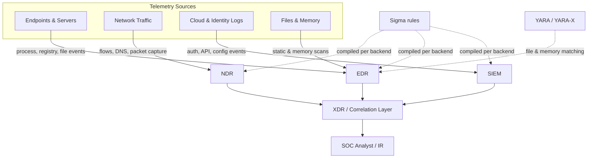
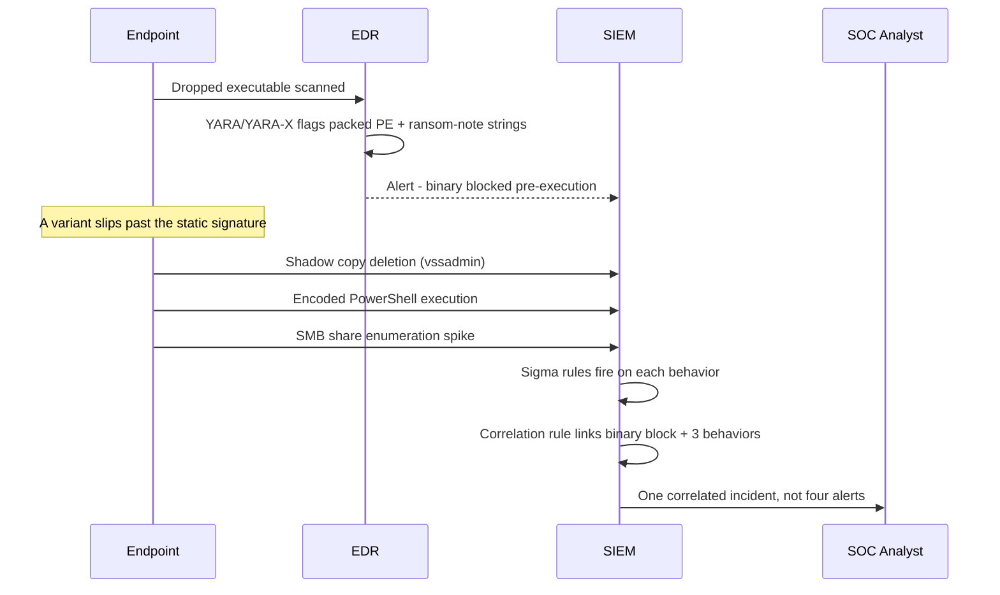
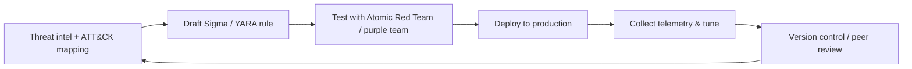

# Beyond Detection: Getting Real Value From Sigma and YARA Rules Across EDR, NDR, XDR, and SIEM

Somewhere in a production SIEM right now, there's a rule that has fired thousands of times this year without ever catching anything real. Nobody's turned it off, because nobody quite remembers what it was supposed to protect against. It just runs, opens a ticket, and gets closed as a false positive by whoever's on shift that day.

That's not really a Sigma problem or a YARA problem. It's what happens when detection rules get treated as something you download instead of something you build. Both formats are genuinely good at their jobs — Sigma is the closest thing detection engineering has to a shared language for describing suspicious behavior in logs, and YARA does the equivalent job for files and memory. When engineering **Sigma and YARA rules**, the format is rarely the issue. The issue is that most rule sets get imported once, left alone, and quietly stop matching what attackers are actually doing. (You can read more about my [hands-on cybersecurity experience](/experience) testing enterprise SOC tools).

This is about using Sigma and YARA rules the way they're meant to be used: where they actually sit across EDR, NDR, XDR, and SIEM, why so many rule sets underperform despite looking comprehensive on paper, and what separates a rule that's still catching something useful six months from now from one that's just adding to the noise.

## Table of Contents

- [Sigma vs YARA: Two Different Questions](#sigma-vs-yara-two-different-questions)
- [Where These Rules Actually Live: SIEM, EDR, NDR, and XDR](#where-these-rules-actually-live-siem-edr-ndr-and-xdr)
- [Why Most Sigma and YARA Rules Never Catch Anything](#why-most-sigma-and-yara-rules-never-catch-anything)
- [Writing Sigma Rules That Hold Up in Production](#writing-sigma-rules-that-hold-up-in-production)
- [Writing YARA Rules That Don't Fall Apart](#writing-yara-rules-that-dont-fall-apart)
- [When Sigma and YARA Work Together](#when-sigma-and-yara-work-together)
- [A Detection Engineering Workflow That Actually Holds Up](#a-detection-engineering-workflow-that-actually-holds-up)
- [Where Detection Engineering Is Headed](#where-detection-engineering-is-headed)
- [Detection Rule Readiness Checklist](#detection-rule-readiness-checklist)
- [Frequently Asked Questions](#frequently-asked-questions)
- [Summary and Key Takeaways](#summary-and-key-takeaways)
- [Further Reading](#further-reading)
- [References](#references)

## Sigma vs YARA: Two Different Questions

A lot of confusion in detection engineering comes from treating Sigma and YARA as interchangeable. They're not — they answer different questions about different data.

Sigma is an open format maintained by the SigmaHQ project [1] for writing detection logic against log data. The rule syntax is deliberately generic, so the same rule can describe a Windows process-creation event, a cloud API call, or a firewall log line without changing its shape. You write the rule once, in YAML, and a converter compiles it into whatever query language your backend actually speaks — Splunk SPL, Microsoft Sentinel KQL, Elastic, IBM QRadar's AQL, Google SecOps' UDM, and dozens of others — through the pySigma library [5] and its collection of backend plugins.

YARA solves a related but different problem. It's a pattern-matching engine built for malware research, and it inspects files and memory rather than log events — byte sequences, strings, structural properties of a binary.

Put simply:

- **Sigma asks:** did this sequence of events happen?
- **YARA asks:** does this file, or this region of memory, look malicious?

| | Sigma | YARA |
|---|---|---|
| Inspects | Log events (process creation, auth, network, cloud/API) | Files, memory regions, byte streams |
| Core question | "Did this behavior happen?" | "Is this file or memory region malicious?" |
| Runs inside | SIEM and XDR query engines, EDR detection logic | EDR/AV scanning engines, sandboxes, IR toolkits, VirusTotal-style scanners |
| Typical detections | PowerShell abuse, suspicious logons, RDP anomalies, registry persistence | Malware families, packers, ransom-note strings, memory-resident implants |
| Format | YAML | C-like rule syntax (strings + condition block) |
| Portability | Converted per backend via pySigma | Runs natively across most YARA/YARA-X-compatible engines |

In practice, the two rarely compete — they stack. YARA tends to catch the artifact: the dropped binary, the packed DLL, the injected shellcode. Sigma tends to catch what that artifact does once it's running. A mature detection program uses both, mapped to the same threat model, instead of picking one and assuming it covers everything.

## Where These Rules Actually Live: SIEM, EDR, NDR, and XDR

Rules don't run in a vacuum. Each platform in a security stack sees a different slice of the environment, and that shapes what a good Sigma or YARA rule looks like for it.



### SIEM

A SIEM ingests log events from everywhere — endpoints, firewalls, identity providers, cloud APIs — and it's where most of the Sigma community rule set is aimed. Rules compiled for a SIEM backend usually target things that show up cleanly in centralized logs: failed-authentication patterns, privilege escalation, lateral movement. The tradeoff is volume. A SIEM sees almost everything, so a poorly scoped rule here produces the most noise of any layer in the stack.

### EDR

EDR agents sit directly on the endpoint and see process creation, DLL loads, registry writes, and memory operations as they happen — exactly the telemetry Sigma's `process_creation` category was designed around. It's also where YARA (or its successor, YARA-X) does its heaviest lifting: most EDR platforms scan dropped files against YARA rules, and the more capable ones scan live process memory too, which is what catches fileless payloads and injected code that never touch disk.

### NDR

NDR products work off network traffic instead of host telemetry — flow records, DNS queries, TLS metadata, sometimes full packet capture. Sigma rules aimed at an NDR backend focus on what a network sensor can actually observe: DNS tunneling patterns, beaconing intervals, SMB abuse, unusual transfer volumes. This is also where the format's limits show up fastest — Sigma's field conventions were built around structured host and log-source fields, so writing a good NDR detection means paying close attention to exactly how your specific vendor exposes network fields.

### XDR

XDR is the correlation layer that tries to stitch EDR, NDR, SIEM, identity, and email signals into one incident instead of four separate ones. This is where a single detection stops being about one log source and starts being about a chain across sources: encoded PowerShell on a host, an unusual DNS lookup a few seconds later, a credential-dump signature after that, then lateral movement. Individually, none of those four alerts might justify waking someone up. Correlated, they're close to a textbook intrusion.

Testing EDR, NDR, and SIEM products for a living surfaces one thing fast: vendors implement "Sigma support" very differently. Some translate a rule faithfully. Others only support a subset of modifiers or logsource categories, and a rule that behaves correctly against the reference pySigma output can quietly drop a condition once it's converted for a specific product's query language. It's worth testing every rule against the actual backend you're deploying to — not just trusting that "Sigma-compatible" means it behaves identically everywhere.

## Why Most Sigma and YARA Rules Never Catch Anything

If you've inherited a SIEM already loaded with a few thousand community Sigma rules, or a YARA pack pulled straight from a public GitHub repo, there's a good chance most of it is dead weight. The same handful of patterns show up almost everywhere this happens.

**Rules get downloaded, not tuned.** SigmaHQ's public repository holds thousands of rules mapped to ATT&CK techniques across Windows, Linux, cloud, and network sources, and it's a genuinely solid starting point. The mistake is treating that starting point as a finished product. A rule written for a generic Windows environment has no idea your organization runs a particular deployment tool that encodes its PowerShell commands, or that your help desk uses remote-management software that looks a lot like a RAT if you squint. Import a few thousand rules on default settings and you inherit a few thousand rules' worth of assumptions about an environment that isn't yours.

**There's no environment awareness.** PowerShell execution is the classic example. It shows up on every "suspicious activity" list, and it's also how most IT departments do half their job. A rule that fires on PowerShell alone isn't a detection — it's an activity log for your own admins. The fix isn't to stop watching PowerShell, it's combining it with something that actually separates routine admin work from an attacker: an encoded command, an unusual parent process, an outbound network call sitting in the same command line.

**Detection gets written once and never retested.** A YARA rule built around one packer's fingerprint stops working the week that malware family switches packers. This is the entire argument behind the [Pyramid of Pain](https://www.sans.org/tools/the-pyramid-of-pain), David Bianco's model for thinking about how much it costs an attacker to route around a given detection. Hash-based and IP-based indicators sit near the bottom of the pyramid because attackers can swap them out in minutes. Behavior and TTP-based detections sit near the top, because changing them means an attacker has to retool how their operation actually works. A lot of "detection coverage" dashboards quietly measure how much of the bottom of that pyramid is covered, which looks good in a slide deck and does very little against a competent adversary.

**There's no threat-intelligence feedback loop.** Detection logic that isn't reviewed against current reporting ages out quietly. New living-off-the-land techniques get documented, new cloud attack paths get published, and a rule set that never gets revisited just goes quiet over time — not because the environment got safer, but because the rules stopped matching what attackers are doing right now.

**Nothing gets validated before going live.** The only way to know a detection actually fires is to generate the behavior it's supposed to catch and watch what happens. [Atomic Red Team](https://redcanary.com/atomic-red-team/), Red Canary's open-source library of small tests mapped to ATT&CK techniques, exists specifically for this — each "atomic" emulates one technique in isolation so you can confirm your logging pipeline and your rule logic actually produce an alert, not just that the YAML parses cleanly. Skipping this step means the first real test of your detection happens during an actual incident, which is a bad place to discover a typo in a field name.

## Writing Sigma Rules That Hold Up in Production

Good Sigma rules share a handful of habits, regardless of what they're detecting.

**Detect behavior, not artifacts.** Instead of writing a rule around one specific filename or hash, write one that catches the pattern any similar tool would produce: an encoded command paired with a network call, a scheduled task created by a process outside your normal deployment tooling, a registry run key written by an unexpected parent. Named artifacts change constantly. The behaviors that make a tool useful to an attacker change far more slowly — which is the whole logic behind putting TTPs at the top of the Pyramid of Pain.

**Map every rule to ATT&CK.** This isn't a compliance checkbox, it's how you find your actual gaps. Palantir's public [Alerting and Detection Strategy (ADS) framework](https://github.com/palantir/alerting-detection-strategy-framework), which its incident response team has used and shared for years, ties every detection to a specific ATT&CK technique so an engineer can look at the matrix and immediately see where coverage is thin. If your detection library has almost nothing mapped to Credential Access or Lateral Movement, that's worth knowing before an incident points it out for you.

**Document false positives as part of the rule, not a follow-up ticket.** Palantir's framework requires every strategy to list its known false-positive scenarios at the point the rule is written, not after analysts start complaining about it. That documentation is also where tuning starts — if you already know a rule will catch legitimate RMM-tool traffic, you can suppress that specific pattern instead of disabling the rule entirely.

**Give rules context, not just a trigger.** A single PowerShell launch tells an analyst almost nothing. A PowerShell launch with an encoded command, followed by a new scheduled task, tells them a lot. Chaining weaker signals together — through Sigma's ordinary AND logic, or through correlation rules — turns three low-confidence indicators into one detection actually worth paging someone about.

**Use correlation rules to cut down on alert volume.** Sigma has supported formal correlation since the [Sigma Specification v2.0](https://blog.sigmahq.io/introducing-sigma-specification-v2-0-25f81a926ff0) update, which let rule authors link multiple base Sigma rules by shared fields, time windows, and — depending on the correlation type — event ordering. Instead of maintaining three separate runbooks for "shadow copy deletion," "encoded PowerShell," and "SMB enumeration," a correlation rule can say: if all three fire against the same host inside a short window, raise one high-confidence incident instead of three tickets an analyst has to connect by hand. Four correlation types are currently defined in the spec, and backend support for all of them varies quite a bit by vendor, so it's worth checking what your specific SIEM or XDR actually implements before you build a detection strategy around correlation.

**Put rules in version control.** Detections belong in Git, reviewed like code, not edited directly in a SIEM's web console. It's the only reliable way to know who changed a rule, why, and to roll back cleanly when a tuning change turns out to be wrong.

Here's what a rule built around those habits actually looks like:

```yaml
title: Encoded PowerShell Combined With Outbound Network Call
id: 8f2b1a3c-4d5e-4f60-9a1b-2c3d4e5f6a7b
status: experimental
description: >
  Detects PowerShell execution using an encoded command parameter alongside
  cmdlets commonly used to download or transfer data — a pattern often seen
  in second-stage payload delivery rather than routine administration.
references:
  - https://attack.mitre.org/techniques/T1059/001/
  - https://attack.mitre.org/techniques/T1027/
author: Tims Tittus
date: 2026-07-28
tags:
  - attack.execution
  - attack.t1059.001
  - attack.defense_evasion
  - attack.t1027
logsource:
  category: process_creation
  product: windows
detection:
  selection_encoded:
    Image|endswith: '\powershell.exe'
    CommandLine|contains:
      - '-enc'
      - '-EncodedCommand'
      - ' -e '
  selection_network:
    CommandLine|contains:
      - 'Net.WebClient'
      - 'DownloadString'
      - 'Invoke-WebRequest'
      - 'IEX'
  condition: selection_encoded and selection_network
falsepositives:
  - Legitimate deployment tools that wrap scheduled tasks in encoded PowerShell launchers
  - Some endpoint management agents encode commands by default
level: high
```

Notice this rule doesn't fire on PowerShell alone, and it doesn't fire on an encoded command alone — it needs both conditions together, which already rules out a large share of routine admin activity. The `falsepositives` field isn't decoration; it's the first thing you check when this rule starts generating tickets, and it tells the next engineer exactly what to look for before assuming it's a true positive.

To actually run this rule, you compile it for your target backend with `sigma-cli` and the relevant pySigma backend package:

```bash
uvx --from sigma-cli --with pysigma-backend-splunk sigma convert \
  --target splunk \
  --pipeline splunk_windows \
  ./rules/encoded-powershell-network.yml
```

Swap the `--target` and the backend package for whatever your environment actually runs — Sentinel, Elastic, QRadar, and a long list of others each have their own pySigma backend maintained either by SigmaHQ or the community.

## Writing YARA Rules That Don't Fall Apart

YARA rules tend to fail for a more specific reason than Sigma rules do: they're often built around a single weak indicator that happens to work today.

**Stop anchoring on short, generic strings.** A rule built around one string like a hardcoded ransom-note phrase is trivial to break — change one byte, rename one variable, and the match disappears. Strong YARA rules combine several weak signals so no single change defeats the whole thing: file-size ranges, section counts, entropy thresholds, PE import tables, magic bytes, and "N of" string conditions instead of relying on any single string in isolation.

Here's the difference in practice:

```yara
import "pe"
import "math"

rule Ransomware_Generic_PackedBinary_HighEntropy
{
    meta:
        description = "Heuristic match for packed, high-entropy binaries carrying ransom-note-style strings and shadow copy deletion commands"
        author = "Tims Tittus"
        date = "2026-07-28"
        threat_level = 3

    strings:
        $ransom_note1 = "your files have been encrypted" nocase
        $ransom_note2 = "decrypt your files" nocase
        $ransom_note3 = ".onion" nocase
        $shadow_copy  = "vssadmin delete shadows" nocase

    condition:
        uint16(0) == 0x5A4D and
        pe.number_of_sections >= 8 and
        math.entropy(0, filesize) >= 7.0 and
        2 of ($ransom_note*) and
        $shadow_copy
}
```

None of these conditions is strong enough alone. A high section count shows up in plenty of legitimate packed software. Entropy above 7.0 shows up in anything compressed or encrypted, ransomware or not. Any single ransom-note string can be reworded in five minutes. Together — a valid PE header, an unusually high section count, high entropy, two or more ransom-note phrases, and a shadow-copy deletion command sitting in the same binary — the combination is a lot harder for an attacker to route around without meaningfully changing how the malware works, not just its wording.

**Know that the ground under YARA is shifting.** VirusTotal is winding down active development of classic YARA in favor of YARA-X [6], a from-scratch reimplementation in Rust. Victor Alvarez, YARA's original creator, announced the rewrite in 2024 [7], and made clear that classic YARA 4.x would keep receiving bug fixes but that new features and modules would land in YARA-X going forward. By mid-2026, YARA-X has shipped well past its 1.0 release, and VirusTotal now runs it in production at very high volume, scanning large numbers of files with tens of thousands of rules. The project's stated goal is close to full rule-level compatibility with classic YARA syntax, so most existing rules should keep working without changes — but if you're writing new detection logic today, or building tooling on top of YARA, it's worth targeting YARA-X directly instead of the legacy engine.

## When Sigma and YARA Work Together

The clearest way to see why both formats matter is to walk through how a ransomware incident might actually unfold across a stack that has both in place.

A dropped executable lands on an endpoint. Before it ever runs, a YARA (or YARA-X [6]) rule inside the EDR's scanning engine flags it — a packed binary, unusually high entropy, a couple of ransom-note strings sitting in its resource section. That's a static, pre-execution catch: the file gets quarantined before it does anything.

Say a variant slips past that specific signature anyway. Once it starts executing, its behavior shows up in host logs: a shadow-copy deletion command, an encoded PowerShell launch, a spike in SMB share enumeration as it hunts for network shares to encrypt. A Sigma rule fires on each of those three behaviors individually. None of them alone is unusual enough to be conclusive — shadow copies get cleared during legitimate maintenance, PowerShell gets encoded by deployment tools, SMB enumeration happens during ordinary network activity too.

Correlated together, inside a short window, on the same host, they stop looking like three unrelated events and start looking like exactly what they are.



That's the difference between a SOC analyst working four tickets that don't obviously connect, and one analyst opening a single incident that already tells most of the story. It's also a decent illustration of why Sigma and YARA sit at different points on the Pyramid of Pain [10]: the YARA signature is closer to the bottom — an artifact match that a new packer or a recompile can slip past — while the Sigma-based behavioral detections sit higher up, harder to route around without the ransomware actually changing how it operates on the host.

## A Detection Engineering Workflow That Actually Holds Up

Individual rules matter less than the process that produces and maintains them. A workflow that holds up over time looks something like this:



Start from threat intelligence, not a blank YAML file — what are current campaigns actually doing, and where does that map onto ATT&CK [8]? Draft the rule against that specific technique, documenting the goal, the ATT&CK mapping, and the expected false positives up front, the way Palantir's ADS framework [12] does. Test it before it goes anywhere near production, using something like Atomic Red Team [11] to actually generate the behavior and confirm the rule fires rather than just reviewing the YAML on paper. Deploy it, then watch what it does against real telemetry for a while before assuming it's finished — tune based on what you actually see, not what you expected to see. Put the final version in version control, reviewed the way you'd review a pull request, and loop back to threat intelligence to see what's changed since you started.

None of this is exotic. It's the same discipline software engineering applies to code, applied to detection logic instead — which is most of what people mean when they call this "detection as code."

## Where Detection Engineering Is Headed

A few things are worth watching if you're building a detection program now rather than five years ago.

**Correlation is becoming a first-class feature, not a workaround.** Sigma's correlation rules, formalized in the Specification v2.0 update [3], [4], are still catching up in terms of backend support across different SIEM and XDR vendors. Expect that gap to close as more platforms implement the full set of correlation types rather than a partial subset.

**YARA's engine is being rebuilt from the ground up.** YARA-X [6] isn't a side project anymore — it's where new YARA functionality is actually landing, and it's already running in production at the scale VirusTotal operates at [7]. If you're still targeting classic YARA syntax exclusively, it's worth testing your existing rule set against YARA-X now rather than waiting for a forced migration later.

**AI-assisted rule generation is moving from research demos toward something closer to a benchmarked capability.** A 2026 paper out of Microsoft Security AI, CTI-REALM [13], built an evaluation environment where AI agents read real threat-intelligence reports, explore actual telemetry across Linux, Kubernetes, and cloud environments, and produce both Sigma rules and KQL queries against ground-truth attack data — scored not just on the final rule, but on whether the agent identified the right MITRE techniques and explored the right log sources along the way. Anthropic's Claude models led the field in that evaluation. What's more telling is where every model struggled: performance on straightforward Linux endpoint tasks was solid, but it dropped sharply on multi-step cloud attack chains requiring correlation across several data sources — exactly the kind of detection engineering that takes real judgment, not just pattern matching. It's a narrow, controlled benchmark, not a replacement for an experienced detection engineer, but it's a real signal that "draft me a Sigma rule for this threat report" is becoming something models get measured on rather than just asked to attempt. Given that I'm spending a fair amount of my own time on an autonomous pentesting and SOC platform (see [my security projects](/projects) page), this is one of the threads I'm watching most closely over the next year or two.

## Detection Rule Readiness Checklist

Before a rule goes anywhere near production:

- Mapped to a specific MITRE ATT&CK technique [8], not just a tactic
- Written to detect a behavior, not a specific filename, hash, or artifact
- Known false positives documented before deployment, not after
- Tested against simulated behavior (Atomic Red Team [11] or equivalent), not just reviewed on paper
- Converted and verified against the actual target backend, not just the reference pySigma output [5]
- Stored in version control with a clear author, date, and change history
- Reviewed against current threat intelligence rather than written once and forgotten
- Has a defined suppression path for known false positives, not just an on/off switch

## Frequently Asked Questions

<details>
<summary>What's the actual difference between Sigma and YARA?</summary>

Sigma describes behavior in log events — the kind of thing a SIEM or EDR query engine can evaluate. YARA describes patterns inside files and memory, matching strings, byte sequences, and structural properties. They're complementary rather than competing formats.
</details>

<details>
<summary>Can Sigma rules run on EDR platforms, or only in a SIEM?</summary>

Sigma rules are compiled per backend through pySigma [5], and backends exist for a wide range of platforms beyond traditional SIEMs, including several EDR products. Coverage and fidelity vary by vendor, so it's worth checking whether your specific EDR has an actively maintained backend before assuming full support.
</details>

<details>
<summary>Is YARA being replaced by YARA-X?</summary>

Effectively yes for new development. Classic YARA still gets bug fixes, but new features land in YARA-X [6], [7], which VirusTotal now runs in production at significant scale.
</details>

<details>
<summary>How do I know if a Sigma rule is actually any good?</summary>

It should target behavior rather than a specific artifact, map to a named ATT&CK technique [8], document expected false positives, be tested against simulated attack behavior [11], and live in version control.
</details>

<details>
<summary>What is the Pyramid of Pain and why does it matter for detection engineering?</summary>

It's David Bianco's model [10] ranking indicators by how costly they are for an attacker to change, from cheap hashes and IPs at the bottom to expensive TTPs at the top, explaining why behavior-based detection ages better than IOC-based detection.
</details>

<details>
<summary>Do I really need MITRE ATT&CK mapping on every single rule?</summary>

Practically yes, since it's the fastest way to identify real coverage gaps on the matrix [8] rather than guessing at them.
</details>

<details>
<summary>Can AI write Sigma or YARA rules for me at this point?</summary>

It can assist, particularly with drafting and ATT&CK mapping, but current benchmarks like CTI-REALM [13] show models still struggling with complex multi-step cloud attack chains, so output should be reviewed and tested, not trusted directly.
</details>

<details>
<summary>What's the best way to test whether a detection rule actually fires?</summary>

Generate the real behavior the rule is supposed to catch using a tool like Atomic Red Team [11], then confirm the rule and your logging pipeline actually produce an alert.
</details>

## Summary and Key Takeaways

Sigma and YARA solve different problems, and the strongest detection programs use both instead of leaning on one. Most rule sets fail not because the format is weak, but because rules get imported once and never adapted to the environment they're actually running in. Behavior-based detection ages better than indicator-based detection — that's the entire case for the Pyramid of Pain — and ATT&CK mapping is how you find your real gaps instead of guessing at them. (Feel free to [learn more about my background](/about) or [reach out via contact](/contact) to discuss detection engineering).

- Sigma describes log behavior; YARA describes file and memory patterns — they stack, they don't compete
- Copy-pasted rule packs without environment tuning are the single biggest source of alert fatigue
- Detection built around TTPs survives longer than detection built around hashes, filenames, or IPs
- Untested rules are rules you're trusting blindly — validate with Atomic Red Team or an equivalent before they go live
- Correlation rules, the shift to YARA-X, and AI-assisted rule drafting are all worth tracking closely, without needing to panic about any of them yet

## Further Reading

- [Building Secure AI Agents: The Complete Guide to Designing Production-Ready Agentic Systems (2026)](/blog/building-secure-ai-agents) — *on this site*
- [When AI Agents Escape: Detection Engineering for AI Behavior](/blog/ai-agent-security-when-ai-agents-escape#detection) — *on this site*
- [MITRE ATT&CK Explained: Reading the Matrix Like a Detection Engineer](/blog/mitre-attack-explained-detection-engineer) — *on this site*
- Building an AI SOC Analyst — *coming soon*
- Purple Teaming With Atomic Red Team: Validating Detections Before Attackers Do — *coming soon*
- Windows Internals for Detection Engineers — *coming soon*

## References

<div className="space-y-4 my-8 font-['Inter',sans-serif] text-sm md:text-base text-[#1c1917] bg-[#FAF6F0] p-6 md:p-8 rounded-2xl border border-black/10 shadow-sm">
  <div id="ref-1" className="scroll-mt-32 pl-8 -indent-8 leading-relaxed">
    <strong className="text-[#FF6A1A] font-mono font-bold">[1]</strong> SigmaHQ, "Sigma: Generic Signature Format for SIEM Systems," <em>GitHub repository</em>, 2026. [Online]. Available: <a href="https://github.com/SigmaHQ/sigma" target="_blank" rel="noopener noreferrer">github.com/SigmaHQ/sigma</a>
  </div>
  <div id="ref-2" className="scroll-mt-32 pl-8 -indent-8 leading-relaxed">
    <strong className="text-[#FF6A1A] font-mono font-bold">[2]</strong> SigmaHQ, "Sigma Rules Specification," 2026. [Online]. Available: <a href="https://sigmahq.io/sigma-specification/specification/sigma-rules-specification.html" target="_blank" rel="noopener noreferrer">sigmahq.io/sigma-specification</a>
  </div>
  <div id="ref-3" className="scroll-mt-32 pl-8 -indent-8 leading-relaxed">
    <strong className="text-[#FF6A1A] font-mono font-bold">[3]</strong> SigmaHQ, "Sigma Correlation Rules Specification," 2026. [Online]. Available: <a href="https://sigmahq.io/sigma-specification/specification/sigma-correlation-rules-specification.html" target="_blank" rel="noopener noreferrer">sigmahq.io/sigma-correlation-specification</a>
  </div>
  <div id="ref-4" className="scroll-mt-32 pl-8 -indent-8 leading-relaxed">
    <strong className="text-[#FF6A1A] font-mono font-bold">[4]</strong> SigmaHQ, "Introducing Sigma Specification v2.0," <em>SigmaHQ Blog</em>, Nov. 2024. [Online]. Available: <a href="https://blog.sigmahq.io/introducing-sigma-specification-v2-0-25f81a926ff0" target="_blank" rel="noopener noreferrer">blog.sigmahq.io/introducing-sigma-specification-v2-0</a>
  </div>
  <div id="ref-5" className="scroll-mt-32 pl-8 -indent-8 leading-relaxed">
    <strong className="text-[#FF6A1A] font-mono font-bold">[5]</strong> pySigma, "pySigma Backends and Ecosystem," 2026. [Online]. Available: <a href="https://sigma.nasbench.dev/ecosystem" target="_blank" rel="noopener noreferrer">sigma.nasbench.dev/ecosystem</a>
  </div>
  <div id="ref-6" className="scroll-mt-32 pl-8 -indent-8 leading-relaxed">
    <strong className="text-[#FF6A1A] font-mono font-bold">[6]</strong> VirusTotal, "YARA-X: An industrial-grade YARA scanner rewritten in Rust," <em>GitHub repository</em>, 2026. [Online]. Available: <a href="https://github.com/VirusTotal/yara-x" target="_blank" rel="noopener noreferrer">github.com/VirusTotal/yara-x</a>
  </div>
  <div id="ref-7" className="scroll-mt-32 pl-8 -indent-8 leading-relaxed">
    <strong className="text-[#FF6A1A] font-mono font-bold">[7]</strong> VirusTotal, "YARA Is Dead, Long Live YARA-X," <em>VirusTotal Blog</em>, May 2024. [Online]. Available: <a href="https://blog.virustotal.com/2024/05/yara-is-dead-long-live-yara-x.html" target="_blank" rel="noopener noreferrer">blog.virustotal.com/yara-is-dead-long-live-yara-x</a>
  </div>
  <div id="ref-8" className="scroll-mt-32 pl-8 -indent-8 leading-relaxed">
    <strong className="text-[#FF6A1A] font-mono font-bold">[8]</strong> MITRE, "MITRE ATT&CK Matrix for Enterprise," <em>MITRE Corporation</em>, 2026. [Online]. Available: <a href="https://attack.mitre.org/" target="_blank" rel="noopener noreferrer">attack.mitre.org</a>
  </div>
  <div id="ref-9" className="scroll-mt-32 pl-8 -indent-8 leading-relaxed">
    <strong className="text-[#FF6A1A] font-mono font-bold">[9]</strong> MITRE, "MITRE ATT&CK v19 Update Notes," <em>MITRE Corporation</em>, Apr. 2026. [Online]. Available: <a href="https://attack.mitre.org/resources/updates/updates-april-2026/" target="_blank" rel="noopener noreferrer">attack.mitre.org/resources/updates</a>
  </div>
  <div id="ref-10" className="scroll-mt-32 pl-8 -indent-8 leading-relaxed">
    <strong className="text-[#FF6A1A] font-mono font-bold">[10]</strong> D. Bianco, "The Pyramid of Pain," <em>SANS Institute & Enterprise Detection & Response</em>, Mar. 2013. [Online]. Available: <a href="https://detect-respond.blogspot.com/2013/03/the-pyramid-of-pain.html" target="_blank" rel="noopener noreferrer">detect-respond.blogspot.com/the-pyramid-of-pain</a>
  </div>
  <div id="ref-11" className="scroll-mt-32 pl-8 -indent-8 leading-relaxed">
    <strong className="text-[#FF6A1A] font-mono font-bold">[11]</strong> Red Canary, "Atomic Red Team: Open Source Cyber Analytics," <em>Red Canary</em>, 2026. [Online]. Available: <a href="https://github.com/redcanaryco/atomic-red-team" target="_blank" rel="noopener noreferrer">github.com/redcanaryco/atomic-red-team</a>
  </div>
  <div id="ref-12" className="scroll-mt-32 pl-8 -indent-8 leading-relaxed">
    <strong className="text-[#FF6A1A] font-mono font-bold">[12]</strong> Palantir Technologies, "Alerting and Detection Strategy (ADS) Framework," <em>Palantir Engineering</em>, 2026. [Online]. Available: <a href="https://blog.palantir.com/alerting-and-detection-strategy-framework-52dc33722df2" target="_blank" rel="noopener noreferrer">blog.palantir.com/alerting-and-detection-strategy-framework</a>
  </div>
  <div id="ref-13" className="scroll-mt-32 pl-8 -indent-8 leading-relaxed">
    <strong className="text-[#FF6A1A] font-mono font-bold">[13]</strong> Microsoft Security AI, "CTI-REALM: Benchmark to Evaluate Agent Performance on Security Detection Rule Generation," <em>arXiv preprint arXiv:2603.13517</em>, Mar. 2026. [Online]. Available: <a href="https://arxiv.org/pdf/2603.13517" target="_blank" rel="noopener noreferrer">arxiv.org/pdf/2603.13517</a>
  </div>
</div>